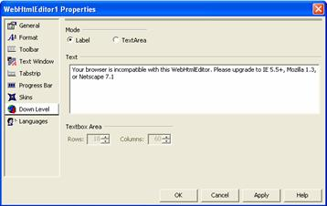

////

|metadata|
{
    "name": "webhtmleditor-webhtmleditor-designer-down-level-tab",
    "controlName": ["WebHtmlEditor"],
    "tags": ["Design Environment","Editing"],
    "guid": "{8A895E66-D8FE-47FA-8527-913A930F6AC4}",  
    "buildFlags": [],
    "createdOn": "0001-01-01T00:00:00Z"
}
|metadata|
////

= WebHtmlEditor Designer (Down Level Tab)

In the Down Level tab, you will find properties relating to WebHtmlEditor's™ contingent support appropriate for down-level browsers. A down-level browser is a browser (usually an older version or one with limited features) that lacks the full JavaScript and HTML Document Object Model support necessary for WebHtmlEditor's editing features. When responding to page requests made from browsers identified as down-level, WebHtmlEditor attempts to fall back on a simpler (and therefore more broadly compatible) set of editing features.

If you expect end users to have web browsers that cannot support the richer WebHtmlEditor editing environment, set the "Mode" of WebHtmlEditor to "Label" as shown in the screenshot above. Those end users will receive a message explaining the minimum browser requirements. If you select the "Label" option you can also use the "Text" field to specify the message users with down-level browsers will receive.