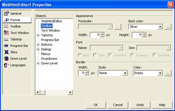
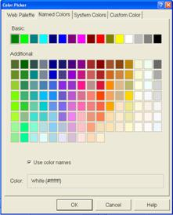

////

|metadata|
{
    "name": "webhtmleditor-webhtmleditor-designer-format-tab",
    "controlName": ["WebHtmlEditor"],
    "tags": ["Data Presentation","Editing"],
    "guid": "{DCA84AC7-1177-4B58-BBD2-3D32AA5CBBE7}",  
    "buildFlags": [],
    "createdOn": "0001-01-01T00:00:00Z"
}
|metadata|
////

= WebHtmlEditor Designer (Format Tab)

Let's look at the Format tab next because this tab contains a number of properties governing the dimensions, colors, fonts, and borders of styleable objects within WebHtmlEditor™. The list of styleable objects that you can format is provided in the center list box. Any selections you make on the right-most panel of the Quick Design will affect the selected object.

.Note:
[NOTE]
====
Because most objects generally have different format values, you cannot select multiple objects to apply the same background color (for example).
====

If you want to see the toolbar with a silvery gray background, simply select "Toolbar" from the list of styleable objects, and select "Silver" from the drop-down list labeled "Back color". Click Apply to commit all changes to the designer view of WebHtmlEditor.

.Note:
[NOTE]
====
*Tip:* The drop down list displays only common colors by name. For a much broader palette of colors to choose from, click the ellipsis button next to the drop-down list to display the Color Picker dialog box.
====