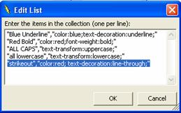

////

|metadata|
{
    "name": "webhtmleditor-webhtmleditor-designer-general-tab",
    "controlName": ["WebHtmlEditor"],
    "tags": ["Design Environment","Editing"],
    "guid": "{3731A4CE-BB6A-4B73-9093-3A0479A0B928}",  
    "buildFlags": [],
    "createdOn": "0001-01-01T00:00:00Z"
}
|metadata|
////

= WebHtmlEditor Designer (General Tab)

The first tab that you're going to learn about is the General tab. Like most tabs, this tab contains several drop-down lists that allow you to specify enumerated property values, for example, whether the  pick:[asp-net="link:{ApiPlatform}webui.webhtmleditor{ApiVersion}~infragistics.webui.webhtmleditor.webhtmleditor~buttonmode.html[ButtonMode]"]  property should use an Image, basic HTML button, TwoStateImage, or ThreeStateImage (each one a value from the  pick:[asp-net="link:{ApiPlatform}webui.webhtmleditor{ApiVersion}~infragistics.webui.webhtmleditor.buttonmode.html[ButtonMode]"]  enumeration).

Key feature of the General tab are the font, formatting and special character lists that control the group of choices that appear in the toolbar's drop-down lists.

[start=1]
. Select the "Font Style" option from the list box and click the Edit List button. In the dialog box shown below, add a user-defined style for yourself using CSS-style rules. For example, you can add a user-defined CSS-style named "strikeout" based on the following style properties:

"color: red; text-decoration: line-through;"

See the screenshot below for the added strikeout style.

[start=2]
. Click OK when you finish editing these lists and then click Apply on the Quick Design to commit all changes. Now verify your changes by pressing Ctrl-F5 to run the Web application. If your WebHtmlEditor's™ toolbar contains the FontStyle drop-down list enter some text, and try selecting the "strikeout" style from the drop-down list, and continue entering more text. Observe that the new text assumes the style as you have defined it in the Font Styles list.

image::images/WebHtmlEditor_Using_the_Property_Builder_of_WebHtmlEditor_04.png[]