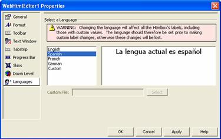

////

|metadata|
{
    "name": "webhtmleditor-webhtmleditor-designer-languages-tab",
    "controlName": ["WebHtmlEditor"],
    "tags": ["Design Environment","Editing","Localization"],
    "guid": "{030BA8F2-F7E2-4E95-9559-4673CB4BE75B}",  
    "buildFlags": [],
    "createdOn": "0001-01-01T00:00:00Z"
}
|metadata|
////

= WebHtmlEditor Designer (Languages Tab)

With the Languages tab, you can change which localization file is used by WebHtmlEditor™ at run time for rendering labels, ToolTips, and static text. You can also specify a custom language file in this tab.

.Note:
[NOTE]
====
When you change the language for WebHtmlEditor, this changes all of the default text values. Therefore, if you have already specified any text for WebHtmlEditor's string-typed properties your changes will be lost (overwritten by the text value in the new language.)
====

If you forget, a prominent advisory label reminds you that you should choose a language before setting other string-typed properties.

If you wish to support a language other than the built-in ones (see link:webhtmleditor-multi-language-support.html[Multi-Language Support] for an up-to-date list) you must copy and localize one of the existing localization files as a custom localization file. This is easy to do since the localization files are only text-based XML documents that can be edited with any editor, including WebHtmlEditor. For more information, see link:webhtmleditor-creating-and-using-a-custom-language-file.html[Creating and Using a Custom Language File].