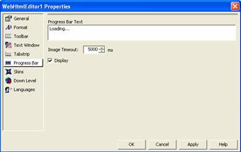

////

|metadata|
{
    "name": "webhtmleditor-webhtmleditor-designer-progress-bar-tab",
    "controlName": ["WebHtmlEditor"],
    "tags": ["Design Environment","Editing"],
    "guid": "{DA1FDA05-685A-4D2F-B483-F972B823D4DD}",  
    "buildFlags": [],
    "createdOn": "0001-01-01T00:00:00Z"
}
|metadata|
////

= WebHtmlEditor Designer (Progress Bar Tab)

WebHtmlEditor™ the Progress Bar tab you can change the text displayed while the progress bar is loading, or make other customizations to this feature. Displaying a progress bar while WebHtmlEditor loads can be useful to you if your Web application is graphics-intensive, or your network has very low bandwidth. It is not displayed by default, so to display a progress bar you must select the "Display" checkbox on this tab and click Apply.

