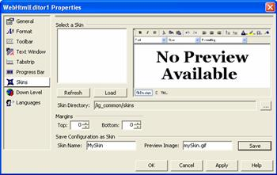

////

|metadata|
{
    "name": "webhtmleditor-webhtmleditor-designer-skins-tab",
    "controlName": ["WebHtmlEditor"],
    "tags": ["Editing","Styling","Theming"],
    "guid": "{0986C4C8-CAFE-4BD0-875C-999C8EC1A089}",  
    "buildFlags": [],
    "createdOn": "0001-01-01T00:00:00Z"
}
|metadata|
////

= WebHtmlEditor Designer (Skins Tab)

When you choose the Skins tab, you're shown a panel of settings controlling how WebHtmlEditor™ operates with skins, which are predefined looks that are saved as XML files on your Web server. In the top half of the pane you're able to select an existing skin, and obtain a preview of it provided it has been associated with a preview image (a thumbnail bitmap in a standard format such as GIF that you must provide). You can click Load to read the skin file from the path specified in the Skins Directory field. And if you like the appearance of the skin you can commit changes to the current WebHtmlEditor on the design surface by clicking Apply.

The bottom half of the panel allows you to save the current appearance that you've designed for WebHtmlEditor through Microsoft® Visual Studio® .NET as a skin file in the skin directory. Click Save to store the "MySkin" file for your WebHtmlEditor's current look and feel in the path specified in theSkins Directory field.