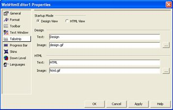

////

|metadata|
{
    "name": "webhtmleditor-webhtmleditor-designer-tabstrip-tab",
    "controlName": ["WebHtmlEditor"],
    "tags": ["Design Environment","Editing"],
    "guid": "{FE3981BE-1D6D-4E57-9EB8-F1BD6E192743}",  
    "buildFlags": [],
    "createdOn": "0001-01-01T00:00:00Z"
}
|metadata|
////

= WebHtmlEditor Designer (TabStrip Tab)

With the Tabstrip, you can customize whether WebHtmlEditor™ appears initially in Design view (a rich What-You-See-Is-What-You-Get editing mode with an active toolbar) or HTML view (a powerful markup editor enabling end users to write HTML) by setting the Startup Mode. Remember to click Apply to commit your changes.

This tab also allows you to modify the default text label and iconic image that appears to the left of the label on the tab. For a step-by-step procedure describing how to set this information programmatically through code-behind, see link:webhtmleditor-customize-the-tab-strip-of-webhtmleditor.html[Customize the Tab Strip] topic.