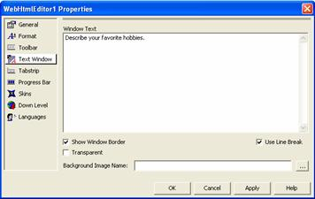

////

|metadata|
{
    "name": "webhtmleditor-webhtmleditor-designer-text-window-tab",
    "controlName": ["WebHtmlEditor"],
    "tags": ["Design Environment","Editing"],
    "guid": "{622D515A-252F-4825-86C9-26D4A4AE6CA3}",  
    "buildFlags": [],
    "createdOn": "0001-01-01T00:00:00Z"
}
|metadata|
////

= WebHtmlEditor Designer (Text Window Tab)

Select the Text Window tab to customize the initial contents of your WebHtmlEditor's™ text window region. For example, if you were to enter some text into the Window Text edit box, it would appear initially when WebHtmlEditor is first displayed.

In order to apply styles to the default window text, embed HTML markup tags into the text you specify here. For example, if you wanted this default text to appear in gray and italics, enter the following text into the "Window Text" edit box:

----
Describe your favorite hobbies.
----

You can also use this tab to specify a background image for the text window (such as a watermark, texture or insignia) and turn off the border that appears around the text window region by default.