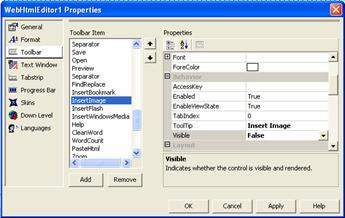

////

|metadata|
{
    "name": "webhtmleditor-webhtmleditor-designer-toolbar-tab",
    "controlName": ["WebHtmlEditor"],
    "tags": ["Design Environment","Editing"],
    "guid": "{E039ED96-8D70-499C-8455-BA5929003D80}",  
    "buildFlags": [],
    "createdOn": "0001-01-01T00:00:00Z"
}
|metadata|
////

= WebHtmlEditor Designer (Toolbar Tab)

Select the Toolbar tab to customize the properties of toolbar items displayed in the top region of WebHtmlEditor™. The center list box contains all of the toolbar items supported by WebHtmlEditor, and you can select the Toolbar item whose properties and behavior you wish to customize. On the right-hand side is a property editor that works similar to the Properties window in Microsoft® Visual Studio® .NET that you are already familiar with. You can use the Quick Design to view and modify individual settings on specific toolbar items.

It is always a good practice to turn off any toolbar items that your Web application does not support. For example, if your Web application disallows users from uploading image files for attachment to their documents, then you are encouraged to remove the "Insert Image" toolbar button because it is unnecessary.

In the Toolbar tab, select the "Insert Image" item in the Toolbar Item list (you will find it listed near the other buttons that provide upload attachments, and which you may also wish to remove). In the Properties window, find the  pick:[asp-net="link:{ApiPlatform}webui.webhtmleditor{ApiVersion}~infragistics.webui.webhtmleditor.basechildcontrol~enabled.html[Enabled]"]  property and set it to False. Click Apply to commit these changes and then run your Web application to verify that the "Insert Image" button is hidden.

For alternative way of dynamically removing a toolbar item through code, see link:webhtmleditor-remove-toolbar-buttons-of-webhtmleditor.html[Remove Toolbar Buttons].