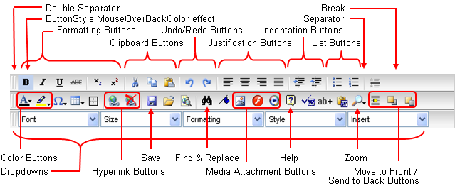

////

|metadata|
{
    "name": "webhtmleditor-webhtmleditor-toolbar",
    "controlName": ["WebHtmlEditor"],
    "tags": ["Editing"],
    "guid": "{3A7E57D2-F20B-4642-8FA7-7ABA1D803ABD}",  
    "buildFlags": [],
    "createdOn": "2006-09-01T00:00:00Z"
}
|metadata|
////

= WebHtmlEditor Toolbar

At the top of the WebHtmlEditor™ control is the toolbar. It contains a number of buttons and drop-down lists, each offering specific behavior that end users who work in other WYSIWYG (What You See Is What You Get) editing environments will be familiar with. For a list of toolbar button functions, see link:webhtmleditor-general-purpose-buttons-of-webhtmleditors-toolbar.html[General-purpose Buttons of WebHtmlEditor's Toolbar].

Your application can hide toolbar buttons that you do not want to be supported by removing them from the Toolbar items collection. For details, see link:webhtmleditor-remove-toolbar-buttons-of-webhtmleditor.html[How to Remove Toolbar Buttons].

== Related Topic:

link:webhtmleditor-customize-the-help-dialog-box-of-webhtmleditor.html[Customize WebHtmlEditor's Help Dialog Box]