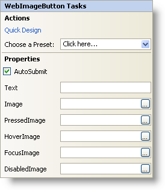

////

|metadata|
{
    "name": "webimagebutton-smart-tag",
    "controlName": ["WebImageButton"],
    "tags": ["Design Environment","Layouts","Styling"],
    "guid": "{5BF8EFB2-BD20-4C4D-8B7A-4D8995305090}",  
    "buildFlags": [],
    "createdOn": "2005-01-11T00:00:00Z"
}
|metadata|
////

= WebImageButton Smart Tag

In Visual Studio 2005 (.NET Framework 2.0), each Infragistics ASP.NET control/component is equipped with a Smart Tag. By simply selecting the control/component, a Smart Tag anchor appears. When you click this anchor, a pop-up panel appears, providing you with quick and easy access to the most common properties and settings of the control/component.

The WebImageButton™ Smart Tag contains the following sections:

* Actions -- Lets you perform common tasks (i.e., accessing the Quick Designer and loading presets).
* Properties -- Provides easy access to common properties such as FocusImage.

See below for a description of the item (e.g., field, drop-down list, checkbox) in each section, as well as the item's corresponding property in the properties grid.

[options="header", cols="a,a,a"]
|====
|Actions|Description|CorrespondingProperty

|Quick Design
|Click Quick Design to access the WebImageButton Designer. This is the same functionality as if you right-clicked on the control and selected Quick Design from the context menu.
|n/a

|Choose a Preset
|Click the "Click here" link and quickly select a preset for WebDateTimeEdit. This is the same functionality as if you opened the WebImageButton Designer, expanded Presets, and clicked on Manage Presets.
|n/a

|====

[options="header", cols="a,a,a"]
|====
|Properties|Description|CorrespondingProperty

|AutoSubmit
|Having this checked forces a postback to the server whenever the control is clicked.
|AutoSubmit

|Text
|The default text displayed on the WebImageButton.
|Text

|Image
|Click the ellipsis (...) to open the Open File dialog and choose a default image for the control.
|Image

|PressedImage
|Click the ellipsis (...) to open the Open File dialog and choose an image for when the control is pressed down or when an action-key (Space, Enter, Escape, etc.) is hit.
|Image (PressedAppearance)

|HoverImage
|Click the ellipsis (...) to open the Open File dialog and choose an image for when the control is hovered over.
|Image (HoverAppearanace)

|FocusImage
|Click the ellipsis (...) to open the Open File dialog and choose an image for when the control gains focus.
|Image (FocusAppearance)

|DisabledImage
|Click the ellipsis (...) to open the Open File dialog and choose an image for when the WebImageButton is disabled.
|Image (DisabledAppearance)

|====