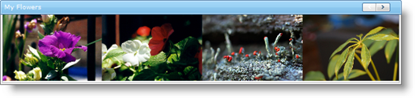

////

|metadata|
{
    "name": "webimageviewer-about-webimageviewer",
    "controlName": ["WebImageViewer"],
    "tags": ["How Do I","Layouts","Styling","Templating"],
    "guid": "{18FD4125-022D-4ED2-9FC1-A0AA7DDF5189}",  
    "buildFlags": [],
    "createdOn": "0001-01-01T00:00:00Z"
}
|metadata|
////

= About WebImageViewer

The WebImageViewer™ control allows you to provide end users with a sleek, easy to use interface for viewing a list of images which can also double up as a navigation control. WebImageViewer will allow end users to continuously cycle through a list of images which when clicked, can be linked to various resources. WebImageViewer's list images can be easily oriented horizontally or vertically through a simple property setting. The WebImageViewer can be a great candidate to allow end users navigate through a list of products, employee records or any other asset you wish to expose within your Web Application. The quick responsiveness and end user experience is thanks to the optimized design that is built from the ground up on top of the Microsoft™ ASP.NET AJAX Framework.

Built with styling in mind, WebImageViewer is seamlessly integrated into the Infragistics Application Styling framework. With CSS based properties, the WebImageViewer control can be manually customized as well by leveraging your existing style sheets.

*The following image shows the WebImageViewer control with its orientation property set to Horizontal:*

WebImageViewer supports the following features:

* Image Orientation - The list of images can be oriented horizontally or vertically.
* Scroll Animation - You can configure the behavior of how images are animated when scrolled. You can scroll through the images one page at a time, one image at a time, or you can continuously scroll.
* Data Binding - Populate the WebImageViewer control by binding to a custom data model that has the path to the images, the target URLs, the Tool Tip text as well as other properties that would otherwise be coded manually.
* Navigation - Use WebImageViewer as a navigation control. Each image can represent a resource for your Web Application. Each image in the list can be linked to a URL. When an image is clicked, the URL can be loaded within the same Page, within a Frame or as a new window.