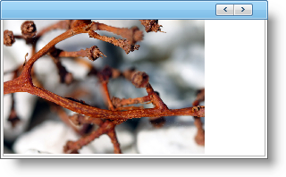

////

|metadata|
{
    "name": "webimageviewer-adding-images-to-the-webimageviewer-on-the-clientside",
    "controlName": ["WebImageViewer"],
    "tags": ["Editing","Layouts","Styling"],
    "guid": "{7BD71739-95BD-46FB-95BC-A0646DC762A5}",  
    "buildFlags": [],
    "createdOn": "0001-01-01T00:00:00Z"
}
|metadata|
////

= Adding Images to the WebImageViewer on the Client Side

== Before You Begin:

The main objective of the WebImageViewer™ is to display images in a viewer. This topic will show you how to add an image to the WebImageViewer on the client side. The following example uses the add method on the ImageItemCollection. The add method takes an ImageItem as the parameter. In order to get an ImageItem, you have to use the createItem method.

== What You Will Accomplish:

This topic will show you how to add an image to the WebImageViewer.

When you save and run your website after completing the following steps, your WebImageViewer should look similar to the WebImageViewer below.

== Follow These Steps:

[start=1]
. From the toolbox, drag the WebImageViewer control on to your page.
[start=2]
. From the Properties window, set the following properties:

** Height -- 200px
** Orientation -- Horizontal
** Width -- 500px

[start=3]
. From the Source view of your Default.aspx, add the following code

*In Javascript:*

----
var iv = $find("WebImageViewer1");
var items = iv.get_items();		
var item = items.createItem();
item.set_imageUrl("~/images/houseplant.jpg");
item.set_altText("addedItem");
item.set_tooltip("addedItem tooltip");
items.add(item);
----

[start=4]
. Save and run your website.