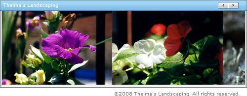

////

|metadata|
{
    "name": "webimageviewer-adding-text-to-webimageviewers-header-and-footer-areas2",
    "controlName": ["WebImageViewer"],
    "tags": ["Editing","Layouts","Styling"],
    "guid": "{4841F596-0F53-4CE5-96F1-B57E309887B1}",  
    "buildFlags": [],
    "createdOn": "0001-01-01T00:00:00Z"
}
|metadata|
////

= Adding Text to WebImageViewer's Header and Footer Areas

== Before You Begin

The WebImageViewer™ control's image viewer contains  pick:[asp-net="link:infragistics4.web.v{ProductVersion}~infragistics.web.ui.listcontrols.webimageviewer~header.html[Header]"]  and  pick:[asp-net="link:infragistics4.web.v{ProductVersion}~infragistics.web.ui.listcontrols.webimageviewer~footer.html[Footer]"]  areas where you can place descriptive text. This text can be whatever your application requires, from describing the current image, to a copyright notice.

== What You Will Accomplish

You will learn how to set the text for WebImageViewer's Header and Footer areas.

== Follow these Steps:

[start=1]
. *Create a new ASP.NET AJAX-Enabled Web Site.*

Ensure that Visual Studio adds an instance of the ASP.NET Ajax ScriptManager when it creates the project.
[start=2]
. *Enable Infragistics Application Styling.*

Ensure that Application Styling is enabled for your application. For help enabling Application Styling, see link:web-enabling-application-styling-using-the-web-config-file.html[Enabling Application Styling Using the web.config File].
[start=3]
. *Add WebImageViewer to your web form.*

Locate the WebImageViewer control in the Visual Studio toolbox and add it to the web form.
[start=4]
. *Set WebImageViewer's Header text.*

With WebImageViewer selected, expand the Header property in the Properties window. Set the following properties:

** Text -- Thelma's Landscaping
** Visible -- True

[start=6]
. *Set WebImageViewer's Footer text.*

With WebImageViewer still selected, expand the Footer property in the Properties window. Set the following properties:

** Text -- © 2008 Thelma's Landscaping. All rights reserved.
** Visible -- True

[start=7]
. *Run the application.*

When you build and run the application, you'll see text displaying in both the Header and Footer areas. Depending on the style you chose for you application, the Header and Footer text may look slightly different from the following screen shot.

