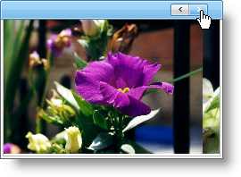

////

|metadata|
{
    "name": "webimageviewer-change-how-the-image-viewer-scrolls-through-images",
    "controlName": ["WebImageViewer"],
    "tags": ["Layouts","Selection","Styling"],
    "guid": "{6026191B-66AF-41B9-9235-D5B838B46CC1}",  
    "buildFlags": [],
    "createdOn": "0001-01-01T00:00:00Z"
}
|metadata|
////

= Change how the Image Viewer Scrolls Through Images

The WebImageViewer™ control utilizes a scroll animation to change the position of the image strip in the viewport. There are three different types of scroll animation:

* Continuous
* NextItem
* Page

For more information, see link:webimageviewer-scroll-animation-types.html[Scroll Animation Types].

The example code below shows you how to set the scroll animation on your WebImageViewer.

*In Visual Basic:*

----
' Sets Type to Scroll by Page
Me.WebImageViewer1.ScrollAnimations.Type = Infragistics.Web.UI.ListControls.ScrollAnimations.Page
' Sets EquationType to EaseIn
Me.WebImageViewer1.ScrollAnimations.Page.EquationType = Infragistics.Web.UI.AnimationEquationType.EaseIn
' Sets Duration to 100
Me.WebImageViewer1.ScrollAnimations.Page.Duration = 100
----

*In C#:*

----
// Sets Type to Scroll by Page
this.WebImageViewer1.ScrollAnimations.Type = Infragistics.Web.UI.ListControls.ScrollAnimations.Page;
// Sets EquationType to EaseIn
this.WebImageViewer1.ScrollAnimations.Page.EquationType = Infragistics.Web.UI.AnimationEquationType.EaseIn;
// Sets Duration to 100
this.WebImageViewer1.ScrollAnimations.Page.Duration = 100;
----

You can also set the scroll animation on the client side.

*In Javascript:*

----
var iv = $find("WebImageViewer1")
var scrollAnimations = iv.get_scrollAnimations();
scrollAnimations.set_type($IG.ScrollAnimation.Page);
var pageAnimation = scrollAnimations.get_pageAnimation();
pageAnimation.set_equationType($IG.AnimationEquationType.EaseIn);
pageAnimation.set_duration(100);
----