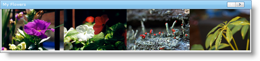

////

|metadata|
{
    "name": "webimageviewer-getting-started-with-the-webimageviewer",
    "controlName": ["WebImageViewer"],
    "tags": ["Getting Started","Layouts","Styling"],
    "guid": "{7DD31A56-D78D-443F-AA99-D106A4F6F115}",  
    "buildFlags": [],
    "createdOn": "2008-12-01T21:03:02Z"
}
|metadata|
////

= Getting Started with the WebImageViewer

== Before You Begin

The following steps will show you how to get started with WebImageViewer™.

*Assumptions for the following steps:*

* You have already created a new ASP.NET AJAX-Enabled Web Site named Getting_Started_with_the_WebImageViewer.
* You have an images folder that contains several image files.
* You have an ASP.NET Ajax ScriptManager instance on the WebForm.
* You have enabled the Infragistics Application Styling for this application and you are using the Default Style. For information on how to do this, see link:web-enabling-application-styling-using-the-web-config-file.html[Enabling Application Styling Using the web.config File].

== What You Will Accomplish

When you finish reading, you will have a WebForm with an instance of the WebImageViewer control that which you can use to navigate and scroll through a list of your images.

== Follow these Steps:

[start=1]
. In the Visual Studio Toolbox, locate the WebImageViewer and double click it. This will place an instance on the WebForm.
[start=2]
. Click the WebImageViewer control and in the Property Window, set the Width property to 600PX and the Height property to 100PX.
[start=3]
. In the Property Window, locate the  pick:[asp-net="link:{ApiPlatform}web{ApiVersion}~infragistics.web.ui.listcontrols.webimageviewer~header.html[Header]"]  property and expand it. Set the following properties:

**  pick:[asp-net="link:{ApiPlatform}web{ApiVersion}~infragistics.web.ui.listcontrols.captionarea~text.html[Text]"]  -- “My Pictures”
** Visible -- true

[start=4]
. Double click the WebForm to add an event handler for the Page Load event.
[start=5]
. In the Page_Load event handler, add the following code to load the WebImageViewer with your images:

*In Visual Basic:*

----
If Me.IsPostBack Then Return
' Get a list of images
Dim imgs() As String = _
  System.IO.Directory.GetFiles("\images", "$$*$$.$$* $$")
' Add a new ImageItem to the WebImageViewer per image
For Each img As String In imgs
        Dim theFile As String = "./images/" + System.IO.Path.GetFileName(img)
        Me.WebImageViewer1.Items.Add( _
          New Infragistics.Web.UI.ListControls.ImageItem(imgUrl, altText, toolTip))
Next
----

*In C#:*

----
if (this.IsPostBack) return;
// Get a list of images
string[] imgs = 
  System.IO.Directory.GetFiles(@"\images", "$$*$$.$$* $$");
// Add a new ImageItem to the WebImageViewer per image
foreach (string img in imgs)
{
        string theFile = "./images/" + System.IO.Path.GetFileName(img);
        this.WebImageViewer1.Items.Add(
          new Infragistics.Web.UI.ListControls.ImageItem(imgUrl, altText, toolTip));
}
----

[start=6]
. Save and run the application. The WebImageViewer will display a horizontal list of images that are in the images directory and should look similar to this:

You can navigate through the list of images by clicking the Next and Previous buttons located on the left and right of the control. You can also click and drag the images directly.