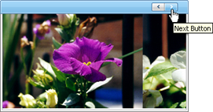

////

|metadata|
{
    "name": "webimageviewer-next-and-previous-buttons",
    "controlName": ["WebImageViewer"],
    "tags": ["Layouts","Selection","Styling"],
    "guid": "{7E2977E3-23B1-4BB4-B0AB-702A0C8EE878}",  
    "buildFlags": [],
    "createdOn": "0001-01-01T00:00:00Z"
}
|metadata|
////

= Next and Previous Buttons

The WebImageViewer™ control uses a viewport to restrict the visible portion of the underlying image strip. For navigation purposes the WebImageViewer control exposes Next and Previous buttons. Your end user can avail of these buttons to scroll through the images.

While navigating through the images they are scrolled using a scroll animation. For more information, see link:webimageviewer-change-how-the-image-viewer-scrolls-through-images.html[Change how the Image Viewer Scrolls Through Images].

By default, the  pick:[asp-net="link:infragistics4.web.v{ProductVersion}~infragistics.web.ui.listcontrols.imagebutton~visible.html[Visible]"]  property on the  pick:[asp-net="link:infragistics4.web.v{ProductVersion}~infragistics.web.ui.listcontrols.webimageviewer~nextbutton.html[NextButton]"]  object and  pick:[asp-net="link:infragistics4.web.v{ProductVersion}~infragistics.web.ui.listcontrols.webimageviewer~previousbutton.html[PreviousButton]"]  object is set to True.

The following code snippet shows how to set properties on the NextButton object.

*In Visual Basic:*

----
Me.WebImageViewer1.NextButton.altText = "Next Button"
----

*In C#:*

----
this.WebImageViewer.NextButton.altText = "Next Button";
----