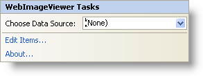

////

|metadata|
{
    "name": "webimageviewer-webimageviewer-smart-tag",
    "controlName": ["WebImageViewer"],
    "tags": ["Design Environment","Layouts","Styling"],
    "guid": "{110F3865-01C8-48E1-8541-6A6473FD7EB2}",  
    "buildFlags": [],
    "createdOn": "0001-01-01T00:00:00Z"
}
|metadata|
////

= WebImageViewer Smart Tag

In Visual Studio 2005/2008 (.NET Framework 2.0/3.5), each Infragistics ASP.NET control/component is equipped with a Smart Tag. By simply selecting the control/component, a Smart Tag anchor appears. When you click this anchor, a pop-up panel appears, providing you with quick and easy access to the most common properties and settings of the control/component.

The WebImageViewer Smart Tag contains the following sections:

* Choose Data Source -- Allows you to choose a data source that has already been configured in your project.

See the table below for a description of the item (e.g., field, drop-down list, checkbox) in each section, as well as the item's corresponding property in the properties grid.

The WebImageViewer™ Smart Tag contains the following links:

* Edit Items -- Selecting this opens the WebImageViewer Quick Designer. This allows you to add an item or edit existing items.
* About -- Selecting this opens the WebImageViewer's product information. It contains information such as Status, Version, Expiration and Product Key.

[options="header", cols="a,a,a"]
|====
|Data Source|Description|CorrespondingProperty

|Choose Data Source
|The drop-down box enables you to select which data source you want the WebImageViewer to use. If you do not have a data source configured, select <New data source...>.
|*DataSource*

|====