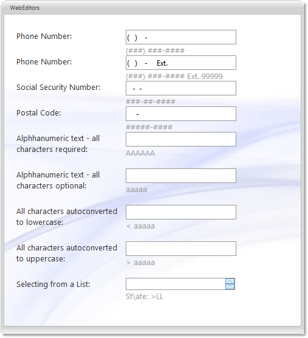

////

|metadata|
{
    "name": "webmaskeditor-about-webmaskeditor",
    "controlName": ["WebMaskEditor"],
    "tags": ["Editing","Getting Started"],
    "guid": "{B374E83E-C219-4ED8-80CF-B017A7A91242}",  
    "buildFlags": [],
    "createdOn": "2009-03-06T14:40:15Z"
}
|metadata|
////

= About WebMaskEditor

WebMaskEditor™ is an editor control which provides extensive and customizable input masking functionality and provides various appearance and behavior based properties. WebMaskEditor is built using the Infragistics ASP.NET AJAX Framework to leverage a proven code base that promotes a high performance and responsive end-user experience. You can find WebMaskEditor in the  pick:[asp-net="link:{ApiPlatform}web{ApiVersion}~infragistics.web.ui.editorcontrols_namespace.html[Infragistics.Web.UI.EditorControls]"]  namespace.

Like all Infragistics ASP.NET AJAX controls, WebMaskEditor seamlessly integrates into the Infragistics® Application Styling Framework. With CSS based properties you can manually customize the WebMaskEditor by leveraging your existing style sheets.

WebMaskEditor also exposes a robust model within the client-side Javascript programming environment. The client-side object model (CSOM) consists of full-fledged properties and methods that enable developers to program significant units of functionality without the need of server-side postbacks.

Some of the WebMaskEditor control’s features include:

* *High-Performance* -- Lightweight markup and optimized code improve performance.
* *Spin Buttons* -- End-users can easily spin through a list of values.
* *Standard Validators support* -- Supports ASP.NET validator controls.
* *ShowMaskOnFocus* -- In edit mode, the displayed string (input pattern) can be built dynamically with cut-off prompts and literal characters on the right side of the caret.
* *SelectionOnFocus* -- You can set different selection types for whenever entering edit mode.
* *InputMask* -- Allows you to set input mask used to filter keyboard entries.
* *PadChar* -- Allows you to set the character that is used to fill the empty mask positions in the display text when the control loses focus.
* *PromptChar* -- Allows you to set the character that is used to fill the empty mask positions in the display text when the control has focus.