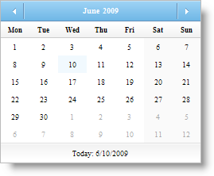

////

|metadata|
{
    "name": "webmonthcalenadar-set-a-custom-day-as-the-first-day-of-the-week",
    "controlName": ["WebMonthCalendar"],
    "tags": ["How Do I","Localization","Styling"],
    "guid": "{B8174A1E-E3AA-47A2-A99C-A3B60B3B15FE}",  
    "buildFlags": [],
    "createdOn": "0001-01-01T00:00:00Z"
}
|metadata|
////

= Set a Custom Day as the First Day of the Week

WebMonthCalendar™ allows you to set any day as the first day of the week. This can be done by simply setting the control's  pick:[asp-net="link:{ApiPlatform}web{ApiVersion}~infragistics.web.ui.editorcontrols.webmonthcalendar~firstdayofweek.html[FirstDayOfWeek]"]  property to one of the following FirstDayOfWeek enumeration members:

* *Sunday* -- Indicates that the first day of the week is Sunday.
* *Monday* -- Indicates that the first day of the week is Monday.
* *Tuesday* -- Indicates that the first day of the week is Tuesday.
* *Wednesday* -- Indicates that the first day of the week is Wednesday.
* *Thursday* -- Indicates that the first day of the week is Thursday.
* *Friday* -- Indicates that the first day of the week is Friday.
* *Saturday* -- Indicates that the first day of the week is Saturday.
* *Default* -- Indicates that the first day of the week is specified by the system settings.

By default, this property is set to Default. You can set the FirstDayOfWeek property either by using the Microsoft® Visual Studio® Property Window or by using the following code:

*In Visual Basic:*

----
 WebMonthCalendar1.FirstDayOfWeek = FirstDayOfWeek.Monday
----

*In C#:*

----
 WebMonthCalendar1.FirstDayOfWeek = FirstDayOfWeek.Monday;
----

