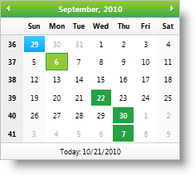

////

|metadata|
{
    "name": "webmonthcalendar-about-webmonthcalendar",
    "controlName": ["WebMonthCalendar"],
    "tags": ["Editing"],
    "guid": "{9B934686-F3CA-4C5B-B595-45B9C3D737AC}",  
    "buildFlags": [],
    "createdOn": "0001-01-01T00:00:00Z"
}
|metadata|
////

= About WebMonthCalendar

WebMonthCalendar™ is a calendar control which renders calendar with one month and provides various appearances and behavior based properties. WebMonthCalendar is built using the Infragistics ASP.NET AJAX Framework to leverage a proven code base that promotes a high performance and responsive end-user experience. You can find WebMonthCalendar in the  pick:[asp-net="link:infragistics4.web.v{ProductVersion}~infragistics.web.ui.editorcontrols_namespace.html[Infragistics.Web.UI.EditorControls]"]  namespace.

Like all Infragistics ASP.NET AJAX controls, WebMonthCalendar seamlessly integrates into the Infragistics® Application Styling Framework. With CSS based properties you can manually customize the WebMonthCalendar by leveraging your existing style sheets.

WebMonthCalendar also exposes a robust model within the client-side Javascript programming environment. The client-side object model (CSOM) consists of full-fledged properties and methods that enable developers to program significant units of functionality without the need of server-side postbacks.

Some of the WebMonthCalendar control’s features include :

* *High-Performance* -- Lightweight markup and optimized code improve performance.
* *Keyboard Navigation* -- Supports accessing the control using keyboard.
* *HotKeys* -- Allows you to set your own hotkeys to open drop-down lists.
* *Standard Validators support* -- Supports ASP.NET validator controls.
* *CustomDays* -- Allows you to modify the appearance of specific days in the calendar.
* *Customizing drop-down lists* -- Provides you the option to customize number of columns for drop-down lists of months and years and number of rows for list of years.
* *Min and Max values* -- You can easily specify the allowable range of dates that can be entered into the editor.
* *Culture* -- You can set the CultureInfo object used by the control for localized formatting.
* *Animations* -- Allows you to customize animations when opening/closing the drop-down lists.
* *CssClasses for Focusing and Hovering* -- Supports for mouseover styles by all areas and focus styles by days.
* *EnableWeekNumbers* -- Provides you an option to show or hide week numbers to the end-user.

The screenshot below depicts the different mouseover and selected styles.

