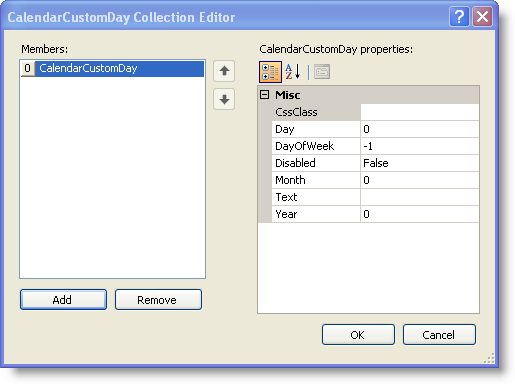

////

|metadata|
{
    "name": "webmonthcalendar-creating-custom-days-in-webmonthcalendar",
    "controlName": ["WebMonthCalendar"],
    "tags": ["Editing","How Do I","Tips and Tricks"],
    "guid": "{8044A18F-5152-45A3-A658-B3B126F5D492}",  
    "buildFlags": [],
    "createdOn": "0001-01-01T00:00:00Z"
}
|metadata|
////

= Creating Custom Days in WebMonthCalendar

== Before You Begin

WebMonthCalendar™ allows you to customize the appearance or define your own text for specific days in the calendar. Your own custom CSS classes can be used to style the text of any day in the calendar. This can be achieved by setting the control’s  pick:[asp-net="link:{ApiPlatform}web{ApiVersion}~infragistics.web.ui.editorcontrols.webmonthcalendar~customdays.html[CustomDays]"]  property.

== What You Will Accomplish

You will learn how to create custom days in WebMonthCalendar.

== Follow these Steps

[start=1]
. From the Microsoft® Visual Studio® Toolbox, drag and drop a ScriptManager component and a WebMonthCalendar control onto the form.
[start=2]
. Include the following code in your ASPX source to define the CSS class for your custom day; once this CSS class is associated to the WebMonthCalendar control, the text of the custom day will change to the color red.

*In HTML:*

----

----

[start=3]
. In the property window, locate the CustomDays property and click the ellipsis(…) button to launch the CalendarCustomDay Collection Editor.
[start=4]
. Click the Add button to add a custom day. Your CalendarCustomDay Collection Editor looks similar to the following image:

[start=5]
. Set the following CalendarCustomDay properties in the right pane of the CalendarCustomDay Collection Editor to display June 26th, 2009 with the letter 'H' in red color :

[options="header", cols="a,a"]
|====
|Property|Value

|CssClass
|myCustomDay

|Day
|26

|Month
|6

|Text
|H

|Year
|2009

|====

[start=6]
. Save and run your application. Your WebMonthCalendar now looks similar to the following image:

[source]
----
----

== Creating Custom Days through the code-behind

[source]
----
//Create an instance of CalendarCustomDay
----

[source]
----
CalendarCustomDay myCustomDay = new CalendarCustomDay();
----

[source]
----
//Set your own Css class to the CssClass property of the custom day
----

[source]
----
myCustomDay.CssClass = "myCustomDay";
----

[source]
----
//Set the Text property to the text you want to display
----

[source]
----
myCustomDay.Text = "H";
----

[source]
----
//Set the day of the month you want to customize
----

[source]
----
myCustomDay.Day = 26;
----

[source]
----
//Set the month
----

[source]
----
myCustomDay.Month = 6;
----

[source]
----
//Set the year
----

[source]
----
myCustomDay.Year = 2009;
----

[source]
----
//Add the custom day you created to the CustomDays collection of WebMonthCalendar
----

[source]
----
WebMonthCalendar1.CustomDays.Add(myCustomDay);
----