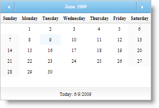

////

|metadata|
{
    "name": "webmonthcalendar-day-name-formats-in-webmonthcalendar",
    "controlName": ["WebMonthCalendar"],
    "tags": ["How Do I","Theming","Tips and Tricks"],
    "guid": "{077B8078-6620-4566-A29E-84A9426AF902}",  
    "buildFlags": [],
    "createdOn": "0001-01-01T00:00:00Z"
}
|metadata|
////

= Day Name Formats in WebMonthCalendar

WebMonthCalendar™ provides you with different display formats for the days of the week. You can set the display format for the days of the week by simply setting the control's  pick:[asp-net="link:{ApiPlatform}web{ApiVersion}~infragistics.web.ui.editorcontrols.webmonthcalendar~daynameformat.html[DayNameFormat]"]  property to one of the following options:

* *Full* -- The days of the week are displayed in full format. For example, Monday.
* *Short* -- The days of the week are displayed in with the first three letters. For example, Thu.
* *FirstLetter* -- The days of the week are displayed with just the first letter in upper case. For example, S.
* *FirstTwoLetters* -- The days of the week are displayed with the first two letters. For example, Sa.
* *Shortest* -- The days of the week are displayed with just the first letter in lower case. For example, f.

You can set the DayNameFormat property either by using the Microsoft® Visual Studio® Property Window or by using the following code:

*In Visual Basic:*

----
WebMonthCalendar1.DayNameFormat = DayNameFormat.Full
----

*In C#:*

----
WebMonthCalendar1.DayNameFormat = DayNameFormat.Full;
----

