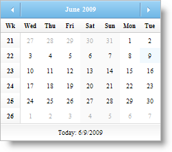

////

|metadata|
{
    "name": "webmonthcalendar-enable-week-numbers-in-webmonthcalendar",
    "controlName": ["WebMonthCalendar"],
    "tags": ["How Do I","Styling"],
    "guid": "{9AD8020F-79E6-4E1A-A0DD-DE057E695371}",  
    "buildFlags": [],
    "createdOn": "2009-01-07T10:15:25Z"
}
|metadata|
////

= Enable Week Numbers in WebMonthCalendar

In some countries, week numbers are used; WebMonthCalendar™ provides you with an option to show week numbers to your end-user. This can be achieved by simply setting the control's  pick:[asp-net="link:infragistics4.web.v{ProductVersion}~infragistics.web.ui.editorcontrols.webmonthcalendar~enableweeknumbers.html[EnableWeekNumbers]"]  property to True. By default, this property is set to False.

You can set the EnableWeekNumbers property either by using the Microsoft® Visual Studio® Property Window or by using the following code:

*In Visual Basic:*

----
WebMonthCalendar1.EnableWeekNumbers = true
----

*In C#:*

----
WebMonthCalendar1.EnableWeekNumbers = true;
----

You can also set your own label to be displayed in the column header of the week numbers by setting the control's  pick:[asp-net="link:infragistics4.web.v{ProductVersion}~infragistics.web.ui.editorcontrols.webmonthcalendar~weeknumberlabel.html[WeekNumberLabel]"]  property.

*In Visual Basic:*

----
WebMonthCalendar1.WeekNumberLabel = "Wk"
----

*In C#:*

----
WebMonthCalendar1.WeekNumberLabel = "Wk";
----

== Rules for Week Numbers

WebMonthCalendar allows you to set different rules for determining the first week of the year. You can set these rules by setting the control's  pick:[asp-net="link:infragistics4.web.v{ProductVersion}~infragistics.web.ui.editorcontrols.webmonthcalendar~weekrule.html[WeekRule]"]  property to one of the following options:

* *FirstDay* -- The first week starts with the first week of the year that has one to seven days.
* *FirstFullWeek* -- The first week starts with the first week of the year that has seven full days.
* *FirstFourDayWeek* -- The first week starts with the first week of the year that has four to seven full days.

.Note:
[NOTE]
====
The WeekRule property depends on the FirstDayOfWeek property i.e., the week numbers change with the first day of the week you have set on the control.
====

*In Visual Basic:*

----
WebMonthCalendar1.WeekRule = System.Globalization.CalendarWeekRule.FirstFullWeek
----

*In C#:*

----
WebMonthCalendar1.WeekRule = System.Globalization.CalendarWeekRule.FirstFullWeek;
----

.Note:
[NOTE]
====
If the EnableWeekNumbers property is set to False then the WeekRule property does not have any effect.
====