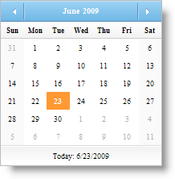
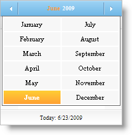
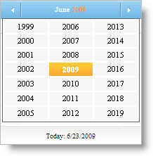
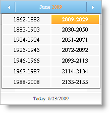

////

|metadata|
{
    "name": "webmonthcalendar-getting-started-with-webmonthcalendar",
    "controlName": ["WebMonthCalendar"],
    "tags": ["Editing","Getting Started"],
    "guid": "{CB90B08B-0EF2-4302-A39A-DECACAC8F07B}",  
    "buildFlags": [],
    "createdOn": "0001-01-01T00:00:00Z"
}
|metadata|
////

= Getting Started with WebMonthCalendar

WebMonthCalendar supports the following four views that your end-users can see at any given point in time:

*Month Calendar View:* This is the first view you see in WebMonthCalendar where you can select the dates in a month.

*Month Selection View:* This view contains the list of the months which is shown by clicking on the label of the month in the header.

*Year Selection View:* This view contains the list of years which is shown by clicking on the label of the year in the header.

*Decade Selection View:* This view contains the list of decades which is shown by clicking on the label of the year when the calendar is in the year selection view.

The lists that can be opened by the end-user depend on how the WebMonthCalendar control's  pick:[asp-net="link:{ApiPlatform}web{ApiVersion}~infragistics.web.ui.editorcontrols.webmonthcalendar~titleformat.html[TitleFormat]"]  property is configured. The TitleFormat property can be set to one of the following members of the  pick:[asp-net="link:{ApiPlatform}web{ApiVersion}~infragistics.web.ui.editorcontrols.calendartitleformat.html[CalendarTitleFormat]"]  enumeration:

* *Month* -- Title shows single label/button with current month.
* *MonthYear* -- Title shows single label/button with format based on the YearMonthPattern of the CultureInfo class (CultureInfo.DateTimeFormat.YearMonthPattern).
* *MonthAndYear* -- Title shows two labels/buttons with current month and year.

.Note:
[NOTE]
====
If drop-down lists are enabled, then the corresponding month and year labels will behave as buttons with support for the following states: normal, mouse-over and pressed.
====

The above scenario works when the TitleFormat property is set to MonthAndYear. However when the TitileFormat is set to Month or MonthYear, clicking on the title opens the list of months with the year in the title; clicking on the year opens the list of years with the decade in the title; clicking on the decade opens up the list of decades.

You can set the TitleFormat property either by using the Microsoft® Visual Studio® Property Window or by using the following code:

*In Visual Basic:*

----
WebMonthCalendar1.TitleFormat = Infragistics.Web.UI.EditorControls.CalendarTitleFormat.Month
----

*In C#:*

----
WebMonthCalendar1.TitleFormat = Infragistics.Web.UI.EditorControls.CalendarTitleFormat.Month;
----