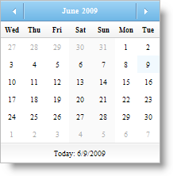

////

|metadata|
{
    "name": "webmonthcalendar-hiding-days-of-previous-and-next-months-in-webmonthcalendar",
    "controlName": ["WebMonthCalendar"],
    "tags": ["How Do I","Styling"],
    "guid": "{34E7CF3A-C50E-471A-948E-637F14775DC0}",  
    "buildFlags": [],
    "createdOn": "0001-01-01T00:00:00Z"
}
|metadata|
////

= Hiding Days of Previous and Next Months in WebMonthCalendar

WebMonthCalendar™ allows you to hide other month days from displaying to the end-user. You can achieve this by simply setting the control's  pick:[asp-net="link:{ApiPlatform}web{ApiVersion}~infragistics.web.ui.editorcontrols.webmonthcalendar~hideothermonthdays.html[HideOtherMonthDays]"]  property to True. By default, this property is set to False.

.Note:
[NOTE]
====
If HideOtherMonthDays property is enabled, then the  pick:[asp-net="link:{ApiPlatform}web{ApiVersion}~infragistics.web.ui.editorcontrols.webmonthcalendar~changemonthtodateclicked.html[ChangeMonthToDateClicked]"]  property has no effect.
====

You can set the HideOtherMonthDays property either by using the Microsoft® Visual Studio® Property Window or by using the following code:

*In Visual Basic:*

----
WebMonthCalendar1.HideOtherMonthDays = true
----

*In C#:*

----
WebMonthCalendar1.HideOtherMonthDays = true;
----

== Before hiding other month days

== After hiding other month days

