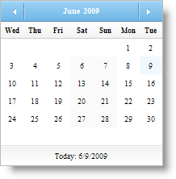
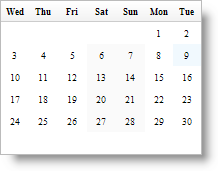

////

|metadata|
{
    "name": "webmonthcalendar-hiding-header-and-footer-of-webmonthcalendar",
    "controlName": ["WebMonthCalendar"],
    "tags": ["How Do I","Styling"],
    "guid": "{8AAF6CF1-134C-45D1-881A-499A06C82410}",  
    "buildFlags": [],
    "createdOn": "0001-01-01T00:00:00Z"
}
|metadata|
////

= Hiding Header and Footer of WebMonthCalendar

WebMonthCalendar™ allows you to hide the header and footer from displaying to the end-user. The header portion of WebMonthCalendar contains two buttons on the left and right sides which allow navigation to next and previous months as well as labels with the month and the year. The footer portion of WebMonthCalendar contains today’s date. You can hide the header and footer by simply setting the control's  pick:[asp-net="link:{ApiPlatform}web{ApiVersion}~infragistics.web.ui.editorcontrols.webmonthcalendar~showheader.html[ShowHeader]"]  and  pick:[asp-net="link:{ApiPlatform}web{ApiVersion}~infragistics.web.ui.editorcontrols.webmonthcalendar~showfooter.html[ShowFooter]"]  properties to false.

You can set the ShowHeader and ShowFooter properties either by using the Microsoft® Visual Studio® Property Window or by using the following code:

*In Visual Basic:*

----
WebMonthCalendar1.ShowFooter = false
WebMonthCalendar1.ShowHeader = false
----

*In C#:*

----
WebMonthCalendar1.ShowFooter = false;
WebMonthCalendar1.ShowHeader = false;
----

== Before hiding header and footer

== After hiding header and footer

