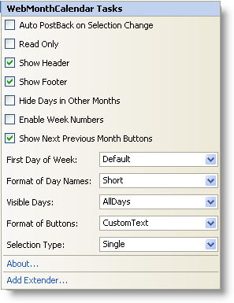

////

|metadata|
{
    "name": "webmonthcalendar-webmonthcalendar-smart-tag",
    "controlName": ["WebMonthCalendar"],
    "tags": ["Design Environment"],
    "guid": "{F57D3A37-5D0A-4A79-B6D0-2AEFFFEAA226}",  
    "buildFlags": [],
    "createdOn": "0001-01-01T00:00:00Z"
}
|metadata|
////

= WebMonthCalendar Smart Tag

In Visual Studio 2005/2008 (.NET Framework 2.0/3.5), each Infragistics ASP.NET control/component is equipped with a Smart Tag. By selecting the control/component, a Smart Tag anchor appears. When you click this anchor, a pop-up panel appears, providing you with quick and easy access to the most common properties and settings of the control/component.

The WebMonthCalendar™ Smart Tag contains the following items:

* Auto PostBack on Value Change -- Allows you to set auto postback options applied to ValueChanged event.
* Read Only -- Allows you to configure whether the end-user can edit the text of the control.
* Show Header -- Allows you to set the visibility of the header which contains two buttons on the left and right sides which allow navigation to next and previous months as well as labels with the month and the year.
* Show Footer -- Allows you to set the visibility of the footer portion which contains today’s date.
* Hide Days in Other Months -- Allows you to hide day numbers in day-cells that belong to previous and next months.
* Enable Week Numbers -- Provides you with an option to show week numbers.
* Show Next Previous Month Buttons -- Allows to set the visibility of active areas in the calendar that allow you to navigate to the next and previous months.
* First Day of Week -- Allows you to set any day of the week as the first day of the week.
* Format of Day Names -- Allows you to set the format of the string that represent the days of the week.
* Visible Days -- Allows you to set the visibility of the text strings that represent days of the week.
* Format of Buttons -- Allows you to set the format of the text that appear on the buttons used to navigate to the previous and next months.
* Selection Type -- Allows you to set the type of selection such as single day, single week or multiple days.

The WebMonthCalendar Smart Tag contains the following links:

* About -- Clicking this opens the WebMonthCalendar product information. It contains information such as Status, Version, Expiration and Product Key.
* Add Extender -- Clicking this will bring up a dialog that shows all of the control extenders that can be used with the WebMonthCalendar.

See the table below for a description of the item, as well as the item's corresponding property in the properties grid.

[options="header", cols="a,a,a"]
|====
|Items|Description|CorrespondingProperty

|Auto PostBack On Value Change
|Gets/Sets auto postback options applied to the ValueChanged event.
|*ValueChanged (AutoPostBackFlags)*

|Read Only
|Gets/Sets the ability for the end-user to edit the text of the control.
|*ReadOnly*

|Show Header
|Gets/Sets the visibility of the header of the control.
|*ShowHeader*

|Show Footer
|Gets/Sets the visibility of the footer of the control.
|*ShowFooter*

|Hide Days in Other Months
|Gets/Sets an option to hide or display day numbers in day-cells that belong to previous and next months.
|*HideOtherMonthDays*

|Enable Week Numbers
|Gets/Sets and option to show the week numbers.
|*EnableWeekNumbers*

|Show Next Previous Month Buttons
|Gets/Sets the visibility of the buttons that are used to navigate to the next and previous months.
|*ShowNextPrevMonth*

|First Day of Week
|Gets/Sets the first day of the week.
|*FirstDayOfWeek*

|Format of Day Names
|Gets/Set the format of the text that represents the days of the week.
|*DayNameFormat*

|Visible Days
|Gets/Sets the visibility of the text that represents the days of the week.
|*VisibleDaynames*

|Format of Buttons
|Gets/Sets the format of the text that appear on the buttons used to navigate to the next and previous months.
|*NextPrevFormat*

|Selection Type
|Gets/Sets the type of the selection such as single day, single week or multiple days.
|*SelectionType*

|====