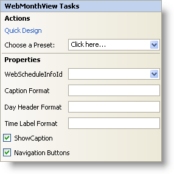

////

|metadata|
{
    "name": "webmonthview-smart-tag",
    "controlName": ["WebSchedule"],
    "tags": ["Design Environment","Scheduling"],
    "guid": "{3BC934B7-FE59-44C8-B6BC-DBBD38C24C9F}",  
    "buildFlags": [],
    "createdOn": "2005-04-11T00:00:00Z"
}
|metadata|
////

= WebMonthView Smart Tag

In Visual Studio 2005 (.NET Framework 2.0), each Infragistics ASP.NET control/component is equipped with a Smart Tag. By simply selecting the control/component, a Smart Tag anchor appears. When you click this anchor, a pop-up panel appears, providing you with quick and easy access to the most common properties and settings of the control/component.

The WebMonthView™ Smart Tag contains the following sections:

* Actions -- Lets you perform common tasks (i.e., accessing the Quick Designer and loading presets).
* Properties -- Provides easy access to common properties such as Caption Format.

See below for a description of the item (e.g., field, drop-down list, checkbox) in each section, as well as the item's corresponding property in the properties grid.

[options="header", cols="a,a,a"]
|====
|Actions|Description|CorrespondingProperty

|Quick Design
|Click Quick Design to access the Quick Designer. This is the same functionality as if you right-clicked on the control and selected Quick Design from the context menu.
|n/a

|Choose a Preset
|Click the "Click here" link and quickly select a preset for UltraWebTab. This is the same functionality as if you opened the Quick Designer, expanded Presets, and clicked on Manage Presets.
|n/a

|====

[options="header", cols="a,a,a"]
|====
|Properties|Description|CorrespondingProperty

|WebScheduleInfoID
|Each view in WebSchedule requires a WebScheduleInfo to function properly. If you already have a WebScheduleInfo on your web form, then it will be visible in the WebScheduleInfoID drop-down.
| pick:[asp-net="link:{ApiPlatform}webui.webschedule{ApiVersion}~infragistics.webui.webschedule.webscheduleviewbase~webscheduleinfo.html[WebScheduleInfoID]"] 

|Caption Format
|Change the format of the caption on the WebMonthView. Use the 'M', 'd', and 'y' characters.
| pick:[asp-net="link:{ApiPlatform}webui.webschedule{ApiVersion}~infragistics.webui.webschedule.webscheduleviewbase~captionheadervisible.html[CaptionFormatString]"] 

|Day Header Format
|Each day has a header and the format of the header can be changed. Use the 'M', 'd', and 'y' characters.
| pick:[asp-net="link:{ApiPlatform}webui.webschedule{ApiVersion}~infragistics.webui.webschedule.dayorientedscheduleview~dayheaderformatstring.html[DayHeaderFormatString]"] 

|Time Label Format
|When an appointment occurs at a specific time, the time is displayed on the day that it occurs. You can change the format of the time label with the 'h', 'H', and 'm' characters. The default is 'HH:mm'.
| pick:[asp-net="link:{ApiPlatform}webui.webschedule{ApiVersion}~infragistics.webui.webschedule.dayorientedscheduleview~timelabelformatstring.html[TimeLabelFormatString]"] 

|Show Caption
|Clicking the check box will cause the caption to be visible.
| pick:[asp-net="link:{ApiPlatform}webui.webschedule{ApiVersion}~infragistics.webui.webschedule.webscheduleviewbase~captionheadervisible.html[CaptionHeaderVisible]"] 

|Navigation Buttons
|This option will show or hide the month navigation buttons at the top of the calendar.
| pick:[asp-net="link:{ApiPlatform}webui.webschedule{ApiVersion}~infragistics.webui.webschedule.webscheduleviewbase~navigationbuttonsvisible.html[NavigationButtonsVisible]"] 

|====