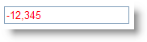

////

|metadata|
{
    "name": "webnumericeditor-styling-negative-text-in-webnumericeditor",
    "controlName": ["WebNumericEditor"],
    "tags": ["Editing","How Do I","Styling"],
    "guid": "{74571CA5-A127-480D-A519-45914CF3249A}",  
    "buildFlags": [],
    "createdOn": "2009-03-06T10:43:45Z"
}
|metadata|
////

= Styling negative text in WebNumericEditor

WebNumericEditor™ allows you to style negative numeric values by simply setting the control’s  pick:[asp-net="link:infragistics4.web.v{ProductVersion}~infragistics.web.ui.editorcontrols.webnumericeditor~negativecssclass.html[NegativeCssClass]"]  property. This will make negative values in the WebNumericEditor control apparent.

== To style negative text in WebNumericEditor:

[start=1]
. Place a ScriptManager component and a WebNumericEditor control on the WebForm.
[start=2]
. Include the following code in your ASPX source to define the negative text CSS class;Once this CSS class is associated to the WebNumericEditor control, the text will change to the color red as soon as a negative value is typed into the control.

*In HTML:*

----

----

[start=3]
. Set the NegativeCssClass property either using the Microsoft® Visual Studio® Property Window or by using the following code:

*In Visual Basic:*

----
WebNumericEditor1.NegativeCssClass = "NegativeText"
----

*In C#:*

----
WebNumericEditor1.NegativeCssClass = "NegativeText";
----

[start=4]
. Save and run your application. Type a negative value in the editor and as soon as the control loses focus you will observe that the CSS class gets applied to the editor similar to the following image:

