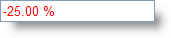

////

|metadata|
{
    "name": "webpercenteditor-styling-negative-text-in-webpercenteditor",
    "controlName": ["WebPercentEditor"],
    "tags": ["Editing","How Do I","Styling"],
    "guid": "{D475DDBD-A405-49DB-8622-CF950E26B4BF}",  
    "buildFlags": [],
    "createdOn": "2009-03-06T13:51:37Z"
}
|metadata|
////

= Styling negative text in WebPercentEditor

WebPercentEditor™ allows you to style negative percent values by simply setting the control’s  pick:[asp-net="link:infragistics4.web.v{ProductVersion}~infragistics.web.ui.editorcontrols.webnumericeditor~negativecssclass.html[NegativeCssClass]"]  property. This will make negative values in the WebPercentEditor control apparent.

== To style negative text in WebPercentEditor:

[start=1]
. Place a ScriptManager component and a WebPercentEditor control on the WebForm.
[start=2]
. Include the following code in your ASPX source to define the negative text CSS class. Once this CSS class is associated to the WebPercentEditor control, the text will change to the color red as soon as a negative value is typed into the control.

*In JavaScript:*

----
     
----

[start=3]
. Set the NegativeCssClass property either using the Microsoft® Visual Studio® Property Window or by using the following code:

*In Visual Basic:*

----
WebPercentEditor1.NegativeCssClass = "NegativeText"
----

*In C#:*

----
WebPercentEditor1.NegativeCssClass = "NegativeText";
----

[start=4]
. Save and run your application. Type a negative value in the editor and as soon as the control loses focus you will observe that the CSS class gets applied to the editor similar to the following image:

