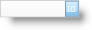

////

|metadata|
{
    "name": "webpercenteditor-using-custom-button-in-webpercenteditor",
    "controlName": ["WebPercentEditor"],
    "tags": ["Editing","How Do I","Styling"],
    "guid": "{AAB3A382-7EB1-4D60-8313-CEE1726F675B}",  
    "buildFlags": [],
    "createdOn": "0001-01-01T00:00:00Z"
}
|metadata|
////

= Using Custom Button in WebPercentEditor

WebPercentEditor™ allows you to have a customized button mainly to raise client and server events. These events can be used to implement custom actions like showing alerts, dialogs, and drop-downs or perform validations, raise postbacks etc. You can display the custom button on the left or on the right by simply setting the  pick:[asp-net="link:infragistics4.web.v{ProductVersion}~infragistics.web.ui.editorcontrols.texteditorbuttons~custombuttondisplay.html[CustomButtonDisplay]"]  property. A list of key actions that trigger the custom button click event can be set by using the control's  pick:[asp-net="link:infragistics4.web.v{ProductVersion}~infragistics.web.ui.editorcontrols.texteditorbuttons~custombuttonhotkeys.html[CustomButtonHotKeys]"]  property.

*In Visual Basic:*

----
WebPercentEditor1.Buttons.CustomButtonDisplay = Infragistics.Web.UI.EditorControls.ButtonDisplay.OnRight
----

*In C#:*

----
WebPercentEditor1.Buttons.CustomButtonDisplay = Infragistics.Web.UI.EditorControls.ButtonDisplay.OnRight;
----

You can also set various properties like text, images, tooltip for the custom button by using the  pick:[asp-net="link:infragistics4.web.v{ProductVersion}~infragistics.web.ui.editorcontrols.texteditorbuttons~custombutton.html[CustomButton]"]  property.

*In Visual Basic:*

----
WebPercentEditor1.Buttons.CustomButton.Text = "IG"
----

*In C#:*

----
WebPercentEditor1.Buttons.CustomButton.Text = "IG";
----

