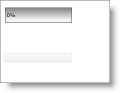
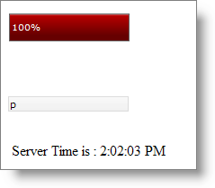

////

|metadata|
{
    "name": "webprogressbar-using-webprogressbar-as-an-ajax-progress-indicator",
    "controlName": ["WebProgressBar"],
    "tags": [],
    "guid": "{E149C0B7-AEBC-45DE-87E8-004D47E6B8A8}",  
    "buildFlags": [],
    "createdOn": "2009-03-03T16:25:59Z"
}
|metadata|
////

= Using WebProgressBar as an AJAX Progress Indicator

== Before You Begin

WebProgressBar™ can be used to visually display the progress of an Ajax postback. For instance, if you make an AJAX request to the server and you expect it to take some time, you can use WebProgressBar as a progress indicator.

In this walkthrough, whenever the user types in the WebTextEdit™, a custom AJAX request is made to fetch and display the server time in a Label control. This AJAX request is monitored using WebProgressBar.

== What You Will Accomplish

You will learn how to show the progress of an AJAX request using WebProgressBar.

== Follow these Steps

[start=1]
. From the Visual Studio™ Toolbox, drag and drop a ScriptManager component, a WebProgressBar control, a WebTextEdit control and a label control onto the form. Name the WebTextEdit control to textedit and the label control to lblMsg.
[start=2]
. Add a Javascript handler for the TextChanged client-side event of WebTextEdit. You can do this by expanding ClientSideEvents in the property window and then locating the TextChanged property. Select Add new handler… from the drop-down. This will automatically create a Javascript function named textedit_TextChanged in the Aspx source.
[start=3]
. Update the textedit_TextChanged JavaScript function with the following code implementation:

*In JavaScript:*

[source]
----
var timeoutId = null;
var objRequest = null;
function textedit_TextChanged(oEdit, newText, oEvent){
    	//clear any time-out settings that you have set using setTimeout 
    	//method on the WebProgressBar
    	if (timeoutId) {
		window.clearTimeout(timeoutId);
        	timeoutId = null;
    	}
----

[source]
----
	//Get the reference of the WebTextEdit
	var textedit = igedit_getById(oEdit);
	if (window.XMLHttpRequest) {
----

[source]
----
    		//Code for all new browsers
		objRequest = new XMLHttpRequest();
	}
----

[source]
----
	else if (window.ActiveXobject) {
		//Code for IE5 and later
		objRequest = new ActiveXObject("Microsoft.XMLHTTP");
	}
----

[source]
----
	if (objRequest == null)
        	return;
    	//Triggers the function when the state of the XMLHttp object changes
        objRequest.onreadystatechange = ProcessResponse;
	//Opens the connection with the server
        objRequest.open("GET", "Default.aspx?GetTime=true", true);
        objRequest.send(null);
}
----

In the above code,

** First two global variables are created; timeoutId, to hold the integer that specifies the time-out setting and objRequest, to hold the XMLHttpRequest object that is used to communicate directly with the server after a web page has loaded .
** In the TextChanged function first the time-out settings that are set using the setTimeout method are cleared.
** Then a new XMLHttpRequest object is created depending on the browser and stored in the objRequest variable.
** Next the request is prepared and sent. While preparing the request, a function named ProcessResponse is invoked when the state of the XMLHttpRequest object changes. The function ProcessResponse is implemented in the next step. In the open method “GetTime=true” is the value of the HTTP query string that is checked on the server.

[start=4]
. Add the following function ProcessResponse in the javascript block:

*In JavaScript:*

----
function ProcessResponse() {
	var progressBar = $find("WebProgressBar1");
	var currentValue = progressBar.get_progressValue() + 5;
	if(currentValue < 100)
		progressBar.set_progressValue(currentValue);
	else {
		currentValue = 99;
		progressBar.set_progressValue(currentValue);
	}
	//If the request has been processed completely
	if(objRequest.readyState == 4)
	{
		//Check if the request is successful  
		if (objRequest.status == 200) {
		var lblMesg = document.getElementById("<%=lblMsg.ClientID%>");
		lblMesg.innerHTML = "Server Time is : " + objRequest.responseText;
		progressBar.set_progressValue(100);
		if (timeoutId == null)
			timeoutId = window.setTimeout(reset,1000);
		}
	}
}
----

In the ProcessResponse function, the value of WebProgressBar is incremented by 5 until the request has been processed completely.

.Note:
[NOTE]
====
The default values of WebProgressBar are 0(minimum value) and 100(maximum value).
====

Once the request is processed completely and is successful, the label displays the time that is sent from the server. Then the value of the progressbar is set to 100 indicating that the request is complete. The progressbar value is again reset to 0 by calling the setTimeout method to evaluate the ‘reset’ function after 1000 milliseconds so that the user can see the progress of another AJAX call. In the next step ‘reset’ function is implemented.
[start=5]
. The reset function sets the value of the WebProgressBar to 0 as shown below:

*In JavaScript:*

----
function reset() {
	var pbar = $find("WebProgressBar1");
	pbar.set_progressValue(0);
}
----

[start=6]
. In this step, the code for accepting the request on the server as well as displaying the response to the end-user is written. Add the following code to the page load event:

*In Visual Basic:*

----
'Prevents the page from being cached and the request
'is sent to the server each time
Response.Cache.SetCacheability(HttpCacheability.NoCache)
if (Request.QueryString["GetTime"] == "true")
{
	Response.Clear()
	Response.Write(DateTime.Now.ToLongTimeString())
	Response.End()
}
----

*In C#:*

[source]
----
//Prevents the page from being cached and the request
//is sent to the server each time
Response.Cache.SetCacheability(HttpCacheability.NoCache);
----

[source]
----
if (Request.QueryString["GetTime"] == "true")
{
	Response.Clear();
	Response.Write(DateTime.Now.ToLongTimeString());
	Response.End();
}
----

In the above code the value of the HTTP query string of the request is verified and returns the server time as reponse.
[start=7]
. Save and run the application. You will observer that as you type in the WebTextEdit tha label displays the updated time from the server.

*Before typing in the TextEdit :*

*After typing in the TextEdit :*

