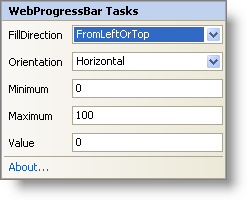

////

|metadata|
{
    "name": "webprogressbar-webprogressbar-smart-tag",
    "controlName": ["WebProgressBar"],
    "tags": ["Design Environment"],
    "guid": "{E70AAE4B-5785-4077-AEE7-8DB25544E358}",  
    "buildFlags": [],
    "createdOn": "0001-01-01T00:00:00Z"
}
|metadata|
////

= WebProgressBar Smart Tag

In Visual Studio 2005/2008 (.NET Framework 2.0/3.5), each Infragistics ASP.NET control/component is equipped with a Smart Tag. By selecting the control/component, a Smart Tag anchor appears. When you click this anchor, a pop-up panel appears, providing you with quick and easy access to the most common properties and settings of the control/component.

The WebProgressBar™ Smart Tag contains the following items:

* FillDirection -- The direction that the progress bar will fill.
* Orientation – The orientation of the WebProgressBar.
* Minimum-- The start value of the WebProgressBar
* Maximum – The end value of the WebProgressBar.
* Value – Current progress of the bar.

The WebProgressBar Smart Tag contains the following links:

* About -- Clicking this opens the WebProgressBar product information. It contains information such as Status, Version, Expiration and Product Key.

See the table below for a description of the items(e.g.,field,drop-down list), as well as the items corresponding property in the properties grid.

[options="header", cols="a,a,a"]
|====
|Items|Description|CorrespondingProperty

|FillDirection
|The drop-down list enables you to select which direction you want to fill the progress bar to have: FromLeftOrTop or FromRightOrBottom.
|*FillDirection*

|Orientation
|The drop-down list enables you to select the orientation of the WebProgressBar to have : Horizontal or Vertical.
|*Orientation*

|Minimum
|Allows you to specify the start value of the bar.
|*Minimum*

|Maximum
|Allows you to specify the end value of the bar.
|*Maximum*

|Value
|Allows you to set the current progress of the bar.
|*Value*

|====