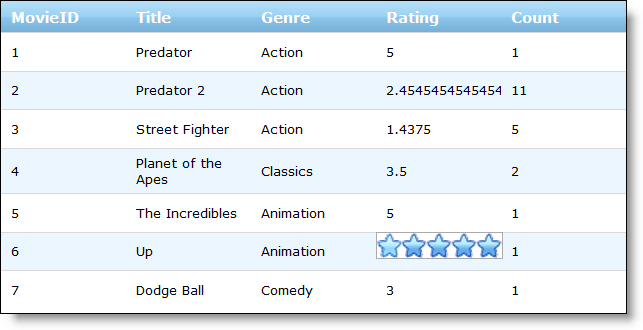

////

|metadata|
{
    "name": "webrating-editor-provider",
    "controlName": ["WebRating"],
    "tags": ["Editing","Selection"],
    "guid": "44e0c2cf-8cc1-4750-b326-0ae308054bb6",  
    "buildFlags": [],
    "createdOn": "2010-06-01T05:45:24.8737753Z"
}
|metadata|
////

= WebRating Editor Provider

The WebRating control functions as an editor for your data; based on interaction with the end user, the control records the information. WebRating is available as an editor provider ,so you can use it as an embeddable editor in Infragistics ASP.NET grid controls.

The process of using WebRating as an editor provider is the same as that for using other editor providers. For more information on editor providers, see link:webdatagrid-editor-providers.html[Editor Providers].

To use WebRating as an editor provider, add a  pick:[asp-net="link:infragistics4.web.v{ProductVersion}~infragistics.web.ui.gridcontrols.ratingeditorprovider.html[RatingEditorProvider]"]  object to the editor provider collection by using the  pick:[asp-net="link:infragistics4.web.v{ProductVersion}~infragistics.web.ui.gridcontrols.webdatagrid~editorproviders.html[EditorProviders]"]  property. Enable any settings for the editor using the object’s  pick:[asp-net="link:infragistics4.web.v{ProductVersion}~infragistics.web.ui.gridcontrols.editorprovider`1~editorcontrol.html[EditorControl]"]  property. Assign the id of the RatingEditorProvider object to the  pick:[asp-net="link:infragistics4.web.v{ProductVersion}~infragistics.web.ui.gridcontrols.columneditsetting~editorid.html[EditorID]"]  property of a column setting for a behavior such as  pick:[asp-net="link:infragistics4.web.v{ProductVersion}~infragistics.web.ui.gridcontrols.cellediting.html[CellEditing]"]  . Then when the end user edits a cell, the WebRating control appears as the editor.

The following code shows you how to use WebRating as the editor provider for the CellEditing behavior.

*In HTML:*

----
<ig:webdatagrid ID="WebDataGrid1" 
            runat="server" 
            Height="350px" Width="800px" 
            DataKeyFields="MovieID"
            DataSourceID="SqlDataSource1"
            >
            <Behaviors>
                <ig:editingcore Enabled="true">
                    <Behaviors>
                    <%-- Use WebRating as editor provider --%>
                    <ig:CellEditing Enabled="true">
                            <ColumnSettings>
                                <ig:EditingColumnSetting ColumnKey="Rating" EditorID="WebDataGrid1_RatingProvider1" />
                            </ColumnSettings>
                        </ig:CellEditing>
                    </Behaviors>
                </ig:editingcore>
            </Behaviors>
            <%-- Add a rating editor provider --%>
            <EditorProviders>
                <ig:RatingEditorProvider ID="WebDataGrid1_RatingProvider1">
                    <EditorControl runat="server" EnableContinuousSelection="true" Precision="Half">
                    </EditorControl>
                </ig:RatingEditorProvider>
            </EditorProviders>
        </ig:webdatagrid>
----

When the user enters edit mode on a cell, the WebRating control displays below the cell for editing.

