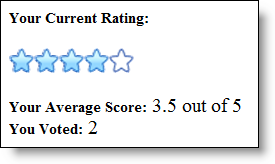

////

|metadata|
{
    "name": "webrating-getting-started-with-webrating",
    "controlName": ["WebRating"],
    "tags": ["Getting Started","Selection"],
    "guid": "f216753f-526b-442d-ae23-12bed6b800ae",  
    "buildFlags": [],
    "createdOn": "2010-06-01T04:44:59.3037535Z"
}
|metadata|
////

= Getting Started with WebRating

== Before You Begin

The WebRating™ control records average and vote count for the user interacting with the control. The control stores the average rating value and total vote count for the user in the  pick:[asp-net="link:{ApiPlatform}web{ApiVersion}~infragistics.web.ui.editorcontrols.webrating~average.html[Average]"]  and  pick:[asp-net="link:{ApiPlatform}web{ApiVersion}~infragistics.web.ui.editorcontrols.webrating~votecount.html[VoteCount]"]  properties, respectively.

== What You Will Accomplish

You will learn how to set up WebRating to record the user’s ratings.

== Follow These Steps

[start=1]
. Drag a WebRating control from the Visual Studio Toolbox onto your page.
[start=2]
. Set up the WebRating control with the following options.

.. Set the  pick:[asp-net="link:{ApiPlatform}web{ApiVersion}~infragistics.web.ui.editorcontrols.webrating~autopostbackflags.html[AutoPostBackFlags]"] . pick:[asp-net="link:{ApiPlatform}web{ApiVersion}~infragistics.web.ui.editorcontrols.ratingautopostbackflags~rated.html[Rated]"]  property to Async. With this setting, WebRating will post back to the server every time a rating item is clicked, allowing the control to keep track of the average and vote count of the end user.
.. Handle the  pick:[asp-net="link:{ApiPlatform}web{ApiVersion}~infragistics.web.ui.editorcontrols.ratingclientevents~rated.html[Rated]"]  client-side event. In this event handler you will display the user’s vote count and average rating on the page.

*In HTML:*

----
<ig:WebRating ID="WebRating1" runat="server" AutoPostBackFlags-Rated="Async" >
   <ClientEvents Rated="WebRating1_RatedEventHandler" />
</ig:WebRating>
----

[start=3]
. Add the following code to the Rated event handler.

*In Javascript:*

----
function WebRating1_RatedEventHandler(webRating, args) {
        var scoreLabel = $get("Score");
        var countLabel = $get("VoteCount");
    var average = webRating.get_average();
        var count = webRating.get_voteCount();
        var max = webRating.get_maximumValue();
        scoreLabel.innerHTML = average + " out of " + max;
        countLabel.innerHTML = " " + count;
}
----

[start=4]
. Add 3 span elements to the page to display information to the user. Your page should look like the following.

*In HTML:*

----

Your Current Rating:
 
 

   <ig:WebRating ID="WebRating1" runat="server" AutoPostBackFlags-Rated="Async" >
               <ClientEvents Rated="WebRating1_RatedEventHandler" />
   </ig:WebRating>

 
Your Average Score:

 
 You Voted:

----

[start=5]
. Run the application. The page displays the user’s average rating and vote count when the user clicks on a rating item.

