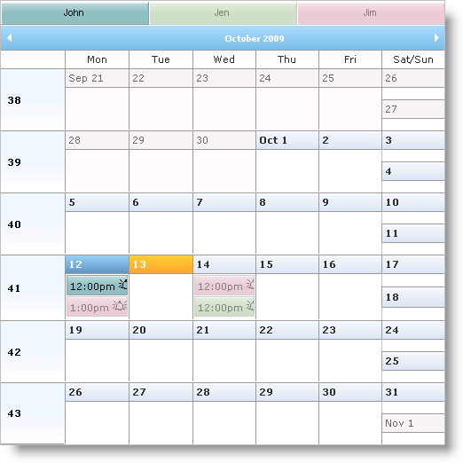
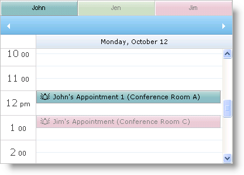

////

|metadata|
{
    "name": "webschedule-about-multi-resource-view",
    "controlName": ["WebSchedule"],
    "tags": ["Getting Started","Scheduling"],
    "guid": "{CEAF1CBC-0408-487D-93DD-63B79A3E8C3B}",  
    "buildFlags": [],
    "createdOn": "0001-01-01T00:00:00Z"
}
|metadata|
////

= About Multi Resource View

The WebSchedule™ controls (WebDayView™ and WebMonthView™) allow you to display scheduling information from multiple resources. To enable multiple resource view, set the WebScheduleInfo™ component's link:{ApiPlatform}webui.webschedule{ApiVersion}~infragistics.webui.webschedule.webscheduleinfo~enablemultiresourceview.html[EnableMultiResourceView] property to True.

== Overlay Mode

Overlay mode allows your end users to see scheduling information for different resources in one view; the active resource displays with a unique style to distinguish it from the inactive resources. For information on customizing the styles for active and inactive resources, see link:webschedule-styling-active-and-inactive-resources.html[Styling Active and Inactive Resources].

A tab control allows you to switch between the different resources. Set the link:{ApiPlatform}webui.webschedule{ApiVersion}~infragistics.webui.webschedule.webdayview~enablemultiresourcecaption.html[EnableMultiResourceCaption] to True or False to control this behavior.

Figure 1 - WebMonthView.

Figure 2 - WebDayView.

== Events

The WebScheduleInfo component contains a link:{ApiPlatform}webui.webschedule{ApiVersion}~infragistics.webui.webschedule.webscheduleinfo~visibleresources.html[VisibleResource] collection that holds Resource objects with scheduling information to be displayed by the WebSchedule controls. You can handle WebScheduleInfo's link:{ApiPlatform}webui.webschedule{ApiVersion}~infragistics.webui.webschedule.webscheduleinfo~resourcesfetched_ev.html[ResourcesFetched] event to manipulate the VisibleResource collection to render only the information you want. You can also pre-populate resources into the collection in the page's PreLoad event. For more information on handling this event, see link:webschedule-set-visible-resources.html[Set Visible Resources].

The following events are available when working with resources:

link:{ApiPlatform}webui.webschedule{ApiVersion}~infragistics.webui.webschedule.webscheduleinfoclientevents~activeresourcechanging.html[ActiveResourceChanging] – Client-side event raised when the active resource is about to change.

link:{ApiPlatform}webui.webschedule{ApiVersion}~infragistics.webui.webschedule.webscheduleinfo~activeresourcechanging_ev.html[ActiveResourceChanging] – Server-side event raised when the active resource is about to change.

link:{ApiPlatform}webui.webschedule{ApiVersion}~infragistics.webui.webschedule.webscheduleinfoclientevents~activeresourcechanged.html[ActiveResourceChanged] – Client-side event raised after the active resource has changed.

link:{ApiPlatform}webui.webschedule{ApiVersion}~infragistics.webui.webschedule.webscheduleinfo~activeresourcechanged_ev.html[ActiveResourceChanged] – Server-side event raised after the active resource has changed.

The following code shows you how to enable multiple resource view.

*In HTML:*

----
<igsch:webscheduleinfo runat="server" ID="WebScheduleInfo1" 
    EnableMultiResourceView="True" EnableSmartCallbacks="True" >
</igsch:webscheduleinfo>
----

*In Visual Basic:*

----
Protected Sub Page_Init(ByVal sender As Object, ByVal e As EventArgs)
    If Not Page.IsPostBack Then
        Me.WebScheduleInfo1.EnableMultiResourceView = True
    End If
End Sub
----

*In C#:*

----
protected void Page_Init(object sender, EventArgs e)
{
    if (!Page.IsPostBack)
    {
        this.WebScheduleInfo1.EnableMultiResourceView = true;
    }
}
----

== Related Topics

link:webschedule-styling-active-and-inactive-resources.html[Styling Active and Inactive Resources]

link:webschedule-set-visible-resources.html[Set Visible Resources]