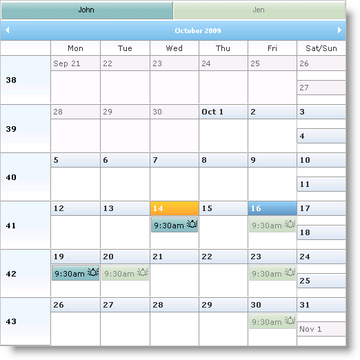

////

|metadata|
{
    "name": "webschedule-binding-to-a-data-set-with-webschedulegenericdataprovider",
    "controlName": ["WebSchedule"],
    "tags": ["Data Binding","How Do I","Scheduling"],
    "guid": "{2C2C7BB6-A1AF-439B-8EDA-1E8BB0DCB405}",  
    "buildFlags": [],
    "createdOn": "0001-01-01T00:00:00Z"
}
|metadata|
////

= WebSchedule Binding to a Data Set with WebScheduleGenericDataProvider

== Before You Begin

The WebScheduleGenericDataProvider™ component allows you to bind to a custom data source of your choice. The WebScheduleInfo component provides the following properties for you to configure the WebSchedule™ data sources:

* link:infragistics4.webui.webscheduledataprovider.v{ProductVersion}~infragistics.webui.data.webschedulegenericdataprovider~activitydatasource.html[ActivityDataSource]/ link:infragistics4.webui.webscheduledataprovider.v{ProductVersion}~infragistics.webui.data.webschedulegenericdataprovider~activitydatasourceid.html[ActivityDataSourceID]
* link:infragistics4.webui.webscheduledataprovider.v{ProductVersion}~infragistics.webui.data.webschedulegenericdataprovider~resourcedatasource.html[ResourceDataSource]/ link:infragistics4.webui.webscheduledataprovider.v{ProductVersion}~infragistics.webui.data.webschedulegenericdataprovider~resourcedatasourceid.html[ResourceDataSourceID]
* link:infragistics4.webui.webscheduledataprovider.v{ProductVersion}~infragistics.webui.data.webschedulegenericdataprovider~variancedatasource.html[VarianceDataSource]/ link:infragistics4.webui.webscheduledataprovider.v{ProductVersion}~infragistics.webui.data.webschedulegenericdataprovider~variancedatasourceid.html[VarianceDataSourceID]

Further, the WebScheduleGenericDataProvider component provides the link:infragistics4.webui.webscheduledataprovider.v{ProductVersion}~infragistics.webui.data.appointmentbinding.html[AppointmentBinding], link:infragistics4.webui.webscheduledataprovider.v{ProductVersion}~infragistics.webui.data.resourcebinding.html[ResourceBinding], and link:infragistics4.webui.webscheduledataprovider.v{ProductVersion}~infragistics.webui.data.variancebinding.html[VarianceBinding] objects for you to set data-binding properties that map to the corresponding objects in the WebScheduleInfo. These properties allow you to specify things such as the data fields to bind to. If the names of your data table's columns or data object's properties match the names expected by WebScheduleGenericDataProvider, the data binding is done automatically and there is no need to define the data fields explicitly. For a list of these names, see link:webschedule-data-model-for-webschedule-generic-data-provider.html[Data Model for WebSchedule Generic Data Provider].

When binding to data objects, handle the link:infragistics4.webui.webschedule.v{ProductVersion}~infragistics.webui.webschedule.webscheduleinfo~activityadding_ev.html[ActivityAdding] and link:infragistics4.webui.webschedule.v{ProductVersion}~infragistics.webui.webschedule.webscheduleinfo~varianceadding_ev.html[VarianceAdding] events to assign the activity id and variance id, respectively.

For more information on WebScheduleGenericDataProvider, see link:webschedulegenericdataprovider-about-webschedulegenericdataprovider.html[About WebScheduleGenericDataProvider].

== What You Will Accomplish

You will learn how to use WebScheduleGenericDataProvider to bind WebMonthView™ to a DataSet object with activity, resource, and variance information.

== Follow these Steps

[start=1]
. Create an ASP.NET Website.
[start=2]
. Drag the WebScheduleInfo component from the Microsoft® Visual Studio™ toolbox onto the page.
[start=3]
. Drag the WebMonthView control onto the page.
[start=4]
. Drag the WebScheduleGenericDataProvider component onto the page.
[start=5]
. Set WebScheduleInfo to enable smart callbacks and handle the link:infragistics4.webui.webschedule.v{ProductVersion}~infragistics.webui.webschedule.webscheduleinfo~activityadding_ev.html[ActivityAdding] and link:infragistics4.webui.webschedule.v{ProductVersion}~infragistics.webui.webschedule.webscheduleinfo~varianceadding_ev.html[VarianceAdding] events.

*In HTML:*

----
<igsch:webscheduleinfo runat="server" ID="WebScheduleInfo1" EnableSmartCallbacks="true" 
    OnActivityAdding="WebScheduleInfo1_ActivityAdding" 
    EnableRecurringActivities="true" 
    EnableMultiResourceView="true" onvarianceadding="WebScheduleInfo1_VarianceAdding"
    >
</igsch:webscheduleinfo>
----

[start=6]
. Create an id for the Activity object in the ActivityAdding event handler. The Activity object needs an id before it can be added to the Activity data source, give it a unique id in the event handler. You need to include using/import statements for the System.Data namespace in this step.

*In Visual Basic:*

----
Protected Sub WebScheduleInfo1_ActivityAdding(ByVal sender As Object, ByVal e As CancelableActivityEventArgs)
    Dim ds As DataSet = TryCast(Me.Session("ds"), DataSet)
    Dim rowCount As Integer = ds.Tables("Appointments").Rows.Count
    Dim lastId As Integer = CInt(ds.Tables("Appointments").Rows(rowCount - 1)(0))
    e.Activity.DataKey = lastId + 1
End Sub
----

*In C#:*

----
protected void WebScheduleInfo1_ActivityAdding(object sender, CancelableActivityEventArgs e)
{
    DataSet ds = this.Session["ds"] as DataSet;
    int rowCount = ds.Tables["Appointments"].Rows.Count;
    int lastId = (int)ds.Tables["Appointments"].Rows[rowCount - 1][0];
    e.Activity.DataKey = lastId + 1;
}
----

[start=7]
. Create an id for the variance in the VarianceAdding event handler.

*In Visual Basic:*

----
Protected Sub WebScheduleInfo1_VarianceAdding(ByVal sender As Object, ByVal e As CancelableActivityEventArgs)
    e.Activity.DataKey = New Random().[Next]()
End Sub
----

*In C#:*

----
protected void WebScheduleInfo1_VarianceAdding(object sender, CancelableActivityEventArgs e)
{
    e.Activity.DataKey = new Random().Next();
}
----

[start=8]
. Set WebScheduleGenericDataProvider's link:infragistics4.webui.webscheduledataprovider.v{ProductVersion}~infragistics.webui.data.webscheduledataproviderbase~webscheduleinfoid.html[WebScheduleInfoID] property to "WebScheduleInfo1" to associate it with the WebScheduleInfo component.

*In HTML:*

----
<ig_scheduledata:WebScheduleGenericDataProvider ID="WebScheduleGenericDataProvider1" runat="server"
WebScheduleInfoID="WebScheduleInfo1" >
<%-- TODO: Set up data binding options --%>
</ig_scheduledata:WebScheduleGenericDataProvider>
----

[start=9]
. Set WebMonthView's WebScheduleInfoID property to "WebScheduleInfo1."

*In HTML:*

----
<igsch:WebMonthView ID="WebMonthView1" runat='server' WebScheduleInfoID="WebScheduleInfo1">
</igsch:WebMonthView>
----

[start=10]
. Set up the data binding options for the appointments, resources, and variances.

.. Create an AppointmentBinding, ResourceBinding, and VarianceBinding objects.
.. Set their respective DataKeyMember and DataMember properties. The DataMember property defines the data entity that the object is to bind to, and the DataKeyMember property is the primary key field of the data entity.
.. Set the AppointmentBinding and VarianceBinding object's ResourceKeyMember property to define the field that relates the appointment data to the resource data. Notice that the VarianceBinding object uses the same data member as the AppointmentBinding. You can do this because a variance is just an appointment with the OriginalStartDateTimeUtc field set to a value.

*In HTML:*

----
<AppointmentBinding DataKeyMember="ID" DataMember="Appointments" ResourceKeyMember="ResourceKey" />
<ResourceBinding DataKeyMember="ID" DataMember="Resources"/>
<VarianceBinding DataKeyMember="ID" DataMember="Appointments" ResourceKeyMember="ResourceKey" />
----

[start=11]
. Create the activity and resource data in the page's Load event on the initial load.

.. Create a DataSet object.

*In Visual Basic:*

----
Dim ds As DataSet
If Not Page.IsPostBack Then
        ' TODO: create and add data to the data set.
    ds = New DataSet("GenericDataProviderSample")
End If
----

*In C#:*

----
DataSet ds;
if (!Page.IsPostBack)
{
    ds = new DataSet("GenericDataProviderSample");
// TODO: create and add data to the data set.
}
----

.. Create a DataTable object to represent the activity data.

*In Visual Basic:*

----
Dim appointmentsTable As New DataTable("Appointments")
appointmentsTable.Columns.Add("ID", GetType(Integer))
appointmentsTable.Columns.Add("StartDateTimeUtc", GetType(DateTime))
appointmentsTable.Columns.Add("Duration", GetType(Integer))
appointmentsTable.Columns.Add("Subject", GetType(String))
appointmentsTable.Columns.Add("AllDayEvent", GetType(Boolean))
appointmentsTable.Columns.Add("Location", GetType(String))
appointmentsTable.Columns.Add("ActivityDescription", GetType(String))
appointmentsTable.Columns.Add("Status", GetType(Integer))
appointmentsTable.Columns.Add("EnableReminders", GetType(Boolean))
appointmentsTable.Columns.Add("ShowTimeAs", GetType(Integer))
appointmentsTable.Columns.Add("Importance", GetType(Integer))
appointmentsTable.Columns.Add("VarianceID", GetType(String))
appointmentsTable.Columns.Add("RecurrencePattern", GetType(String))
appointmentsTable.Columns.Add("RecurrenceID", GetType(Integer))
appointmentsTable.Columns.Add("OriginalStartDateTimeUtc", GetType(DateTime))
appointmentsTable.Columns.Add("ResourceKey", GetType(String))
----

*In C#:*

----
DataTable appointmentsTable = new DataTable("Appointments");
appointmentsTable.Columns.Add("ID", typeof(int));
appointmentsTable.Columns.Add("StartDateTimeUtc", typeof(DateTime));
appointmentsTable.Columns.Add("Duration", typeof(int));
appointmentsTable.Columns.Add("Subject", typeof(string));
appointmentsTable.Columns.Add("AllDayEvent", typeof(bool));
appointmentsTable.Columns.Add("Location", typeof(string));
appointmentsTable.Columns.Add("ActivityDescription", typeof(string));
appointmentsTable.Columns.Add("Status", typeof(int));
appointmentsTable.Columns.Add("EnableReminders", typeof(bool));
appointmentsTable.Columns.Add("ShowTimeAs", typeof(int));
appointmentsTable.Columns.Add("Importance", typeof(int));
appointmentsTable.Columns.Add("VarianceID", typeof(string));
appointmentsTable.Columns.Add("RecurrencePattern", typeof(string));
appointmentsTable.Columns.Add("RecurrenceID", typeof(int));
appointmentsTable.Columns.Add("OriginalStartDateTimeUtc", typeof(DateTime));
appointmentsTable.Columns.Add("ResourceKey", typeof(string));
----

.. Create a utility function to add data to the Appointments table.

*In Visual Basic:*

----
Protected Function CreateAppointment(ByVal id As Integer, ByVal startDateTime As DateTime, ByVal appointmentDuration As Integer, ByVal appName As String, ByVal location As String, ByVal appDescription As String, _
ByVal allDayEvent As Boolean) As Object()
Return New Object() {id, startDateTime.ToUniversalTime(), appointmentDuration, appName, allDayEvent, location, _
        appDescription, 1, False, 1, 1, Guid.NewGuid().ToString(), _
"", Nothing, Nothing, "-999"}
End Function
----

*In C#:*

----
protected object[] CreateAppointment(int id, DateTime startDateTime, int appointmentDuration,
string appName, string location, string appDescription, bool allDayEvent)
{
	return new object[] 
    { 
        id, 
        startDateTime.ToUniversalTime(), 
        appointmentDuration, 
        appName, 
        allDayEvent, 
        location, 
        appDescription, 
        1, 
        false, 
        1, 
        1, 
        Guid.NewGuid().ToString(), 
        "", 
        null, 
        null, 
        "-999" 
    };
}
----

.. Add data to the Appointments table.

*In Visual Basic:*

----
appointmentsTable.Rows.Add(CreateAppointment(1, DateTime.Today.AddHours(9), 3600, "Sales Expo", "NYC", "Description", _
    False))
appointmentsTable.Rows.Add(CreateAppointment(2, DateTime.Today.AddDays(3).AddHours(14), 4000, "Win 7 Rollout ", "US", "Description", _
    False))
appointmentsTable.Rows.Add(CreateAppointment(3, DateTime.Today.AddDays(5).AddHours(11), 4600, "Finalise Merger", "Milan", "Description", _
    False))
appointmentsTable.Rows.Add(CreateAppointment(4, DateTime.Today.AddDays(10).AddHours(13), 3600, "Tour Sites", "India", "Description", _
    False))
appointmentsTable.Rows.Add(CreateAppointment(5, DateTime.Today.AddDays(-3).AddHours(10), 4600, "Roadshow", "Abu Dhabi", "Description", _
    False))
appointmentsTable.Rows.Add(CreateAppointment(6, DateTime.Today.AddDays(-10).AddHours(13), 3200, "VC Golf", "Country Club", "Description", _
    False))
appointmentsTable.Rows.Add(CreateAppointment(7, DateTime.Today.AddDays(-15).AddHours(13), 3600, "Conf Call", "London", "Description", _
    False))
appointmentsTable.Rows.Add(CreateAppointment(8, DateTime.Today.AddDays(-20).AddHours(9), 3600 $$*$$ 24 $$* $$ 2, "DevReach Conference", "Sofia", "The fourth edition of the premier developer conference on Microsoft technologies in SEE", _
    True))
----

*In C#:*

----
appointmentsTable.Rows.Add(
    CreateAppointment(1, DateTime.Today.AddHours(9), 3600, "Sales Expo", "NYC", "Description", false)
    );
appointmentsTable.Rows.Add(
    CreateAppointment(2, DateTime.Today.AddDays(3).AddHours(14), 4000, "Win 7 Rollout ", "US", "Description", false)
    );
appointmentsTable.Rows.Add(
    CreateAppointment(3, DateTime.Today.AddDays(5).AddHours(11), 4600, "Finalise Merger", "Milan", "Description", false)
    );
appointmentsTable.Rows.Add(
   CreateAppointment(4, DateTime.Today.AddDays(10).AddHours(13), 3600, "Tour Sites", "India", "Description", false)
   );
appointmentsTable.Rows.Add(
    CreateAppointment(5, DateTime.Today.AddDays(-3).AddHours(10), 4600, "Roadshow", "Abu Dhabi", "Description", false)
    );
appointmentsTable.Rows.Add(
    CreateAppointment(6, DateTime.Today.AddDays(-10).AddHours(13), 3200, "VC Golf", "Country Club", "Description", false)
    );
appointmentsTable.Rows.Add(
    CreateAppointment(7, DateTime.Today.AddDays(-15).AddHours(13), 3600, "Conf Call", "London", "Description", false)
    );
appointmentsTable.Rows.Add(
    CreateAppointment(8, DateTime.Today.AddDays(-20).AddHours(9), 3600 $$*$$ 24 $$* $$ 2, "DevReach Conference", "Sofia",
    "The fourth edition of the premier developer conference on Microsoft technologies in SEE", true)
    );
----

.. Create a DataTable object with data for resources.

*In Visual Basic:*

----
Dim resourcesTable As New DataTable("Resources")
resourcesTable.Columns.Add("ID", GetType(Integer))
resourcesTable.Columns.Add("ResourceName", GetType(String))
resourcesTable.Columns.Add("ResourceDescription", GetType(String))
resourcesTable.Columns.Add("EmailAddress", GetType(String))
resourcesTable.Rows.Add(New Object() {-999, "Unassigned", "Unassigned Resource", "unassigned@unassigned"})
resourcesTable.Rows.Add(New Object() {-998, "John", "John Resource", "John@Webmail"})
resourcesTable.Rows.Add(New Object() {-997, "Jen", "Jen", "Jen@Webmail"})
----

*In C#:*

----
DataTable resourcesTable = new DataTable("Resources");
resourcesTable.Columns.Add("ID", typeof(int));
resourcesTable.Columns.Add("ResourceName", typeof(string));
resourcesTable.Columns.Add("ResourceDescription", typeof(string));
resourcesTable.Columns.Add("EmailAddress", typeof(string));
resourcesTable.Rows.Add(new object[] { -999, "Unassigned", "Unassigned Resource", "unassigned@unassigned" });
resourcesTable.Rows.Add(new object[] { -998, "John", "John Resource", "John@Webmail" });
resourcesTable.Rows.Add(new object[] { -997, "Jen", "Jen", "Jen@Webmail" });
----

.. Add the two tables to the data set and store the data set in session state. The reason you need to store the data set in session and bind to it on every postback is that WebSchedule fetches new data every time a postback occurs (asynchronous or not).

*In Visual Basic:*

----
ds.Tables.Add(appointmentsTable)
ds.Tables.Add(resourcesTable)
Me.Session("ds") = ds
----

*In C#:*

----
ds.Tables.Add(appointmentsTable);
ds.Tables.Add(resourcesTable);
this.Session["ds"] = ds;
----

.. Set the data source for the appointments, resources, and variances outside of the If statement so it occurs on every postback.

*In Visual Basic:*

----
WebScheduleGenericDataProvider1.ActivityDataSource = Me.Session("ds")
WebScheduleGenericDataProvider1.ResourceDataSource = Me.Session("ds")
WebScheduleGenericDataProvider1.VarianceDataSource = Me.Session("ds")
----

*In C#:*

----
WebScheduleGenericDataProvider1.ActivityDataSource = this.Session["ds"];
WebScheduleGenericDataProvider1.ResourceDataSource = this.Session["ds"];
WebScheduleGenericDataProvider1.VarianceDataSource = this.Session["ds"];
----

[start=12]
. Run the application. The WebMonthView control displays the data you just created for resources and the associating activities. Inserts, updates, and deletes are handled for the data set.

== Related Topics

link:webschedule-handle-concurrency-conflicts.html[Handle Concurrency Conflicts]

link:webschedule-connecting-webschedule-to-a-database-in-visual-studio-2005.html[Connecting WebSchedule to a Database in Visual Studio 2005]

link:webschedule-binding-to-access-data-source-using-webschedulegenericdataprovider.html[Binding to Access Data Source Control Using WebScheduleGenericDataSource]

link:webschedule-webschedulegenericdataprovider-crud-statements-for-sql-data-source.html[WebScheduleGenericDataProvider CRUD Statements for SQL Data Source]