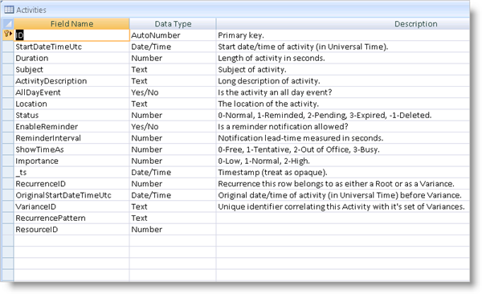

////

|metadata|
{
    "name": "webschedule-binding-to-access-data-source-using-webschedulegenericdataprovider",
    "controlName": ["WebSchedule"],
    "tags": ["Data Binding","How Do I","Scheduling"],
    "guid": "{DE73FBEF-99C5-4D04-925B-9ED79984CEF1}",  
    "buildFlags": [],
    "createdOn": "0001-01-01T00:00:00Z"
}
|metadata|
////

= Binding to Access Data Source Control Using WebScheduleGenericDataSource

== Before You Begin

The WebScheduleGenericDataProvider™ component allows you to bind to a custom data source of your choice. The WebScheduleInfo component provides the following properties for you to configure the WebSchedule™ data entity data sources:

* link:{ApiPlatform}webui.webscheduledataprovider{ApiVersion}~infragistics.webui.data.webschedulegenericdataprovider~activitydatasource.html[ActivityDataSource]/ link:{ApiPlatform}webui.webscheduledataprovider{ApiVersion}~infragistics.webui.data.webschedulegenericdataprovider~activitydatasourceid.html[ActivityDataSourceID]
* link:{ApiPlatform}webui.webscheduledataprovider{ApiVersion}~infragistics.webui.data.webschedulegenericdataprovider~resourcedatasource.html[ResourceDataSource]/ link:{ApiPlatform}webui.webscheduledataprovider{ApiVersion}~infragistics.webui.data.webschedulegenericdataprovider~resourcedatasourceid.html[ResourceDataSourceID]
* link:{ApiPlatform}webui.webscheduledataprovider{ApiVersion}~infragistics.webui.data.webschedulegenericdataprovider~variancedatasource.html[VarianceDataSource]/ link:{ApiPlatform}webui.webscheduledataprovider{ApiVersion}~infragistics.webui.data.webschedulegenericdataprovider~variancedatasourceid.html[VarianceDataSourceID]

Further, the WebScheduleGenericDataProvider component provides the link:{ApiPlatform}webui.webscheduledataprovider{ApiVersion}~infragistics.webui.data.appointmentbinding.html[AppointmentBinding], link:{ApiPlatform}webui.webscheduledataprovider{ApiVersion}~infragistics.webui.data.resourcebinding.html[ResourceBinding], and link:{ApiPlatform}webui.webscheduledataprovider{ApiVersion}~infragistics.webui.data.variancebinding.html[VarianceBinding] objects for you to set data-binding properties that map to the corresponding objects in the WebScheduleInfo. These properties allow you to specify things such as the data fields to bind to. If the names of your data table's columns or data object's properties match the names expected by WebScheduleGenericDataProvider, the data binding is done automatically and there is no need to define the data fields explicitly. For a list of these names, see link:webschedule-data-model-for-webschedule-generic-data-provider.html[Data Model for WebSchedule Generic Data Provider].

When binding to data source controls, you need to specify the create, update, and delete statements in order to update your data base.

For more information on WebScheduleGenericDataProvider, see link:webschedulegenericdataprovider-about-webschedulegenericdataprovider.html[About WebScheduleGenericDataProvider].

This tutorial uses a sample data base called WebScheduleSampleData.mdb. The data fields are depicted below.

== What You Will Accomplish

You will learn how to bind to Activity, Resource, and variance data in an Access Data Source, displaying them in a WebMonthView™ control.

== Follow these Steps

[start=1]
. Create an ASP.NET Website.
[start=2]
. Drag the WebScheduleInfo component from the Microsoft® Visual Studio™ toolbox onto the page.
[start=3]
. Drag the WebMonthView control onto the page.
[start=4]
. Drag the WebScheduleGenericDataProvider component onto the page.
[start=5]
. Drag three AccessDataSource components onto the page.
[start=6]
. Name the data sources ActivityDataSource, ResourceDataSource, and VarianceDataSource.
[start=7]
. Connect ActivityDataSource to the data base and set the Create, Update, and Delete commands.

.Note:
[NOTE]
====
The Delete statement needs to use the VarianceID field and not the activity id.
====

*In HTML:*

----
<asp:AccessDataSource ID="activityDataSource" runat="server" DataFile="~/App_Data/WebScheduleSampleData.mdb"
    DeleteCommand="DELETE FROM [Activities] WHERE [VarianceID] = ?" InsertCommand="INSERT INTO [Activities] ([StartDateTimeUtc], [Duration], [Subject], [AllDayEvent], [Location], [Status], [EnableReminder], [ReminderInterval], [ShowTimeAs], [Importance], [RecurrenceID], [OriginalStartDateTimeUtc], [RecurrencePattern], [ResourceID], [VarianceID], [ActivityDescription]) VALUES (?, ?, ?, ?, ?, ?, ?, ?, ?, ?, ?, ?, ?, ?, ?, ?)"
    SelectCommand="SELECT * FROM [Activities]" UpdateCommand="UPDATE [Activities] SET [StartDateTimeUtc] = ?, [Duration] = ?, [Subject] = ?, [AllDayEvent] = ?, [Location] = ?, [Status] = ?, [EnableReminder] = ?, [ReminderInterval] = ?, [ShowTimeAs] = ?, [Importance] = ?, [RecurrenceID] = ?, [OriginalStartDateTimeUtc] = ?, [RecurrencePattern] = ?, [ResourceID] = ?, [VarianceID] = ?, [ActivityDescription] = ? WHERE [ID] = ?">
    <DeleteParameters>
        <asp:Parameter Name="VarianceID" Type="String" />
    </DeleteParameters>
    <UpdateParameters>
        <asp:Parameter Name="StartDateTimeUtc" Type="DateTime" />
        <asp:Parameter Name="Duration" Type="Int32" />
        <asp:Parameter Name="Subject" Type="String" />
        <asp:Parameter Name="AllDayEvent" Type="Boolean" />
        <asp:Parameter Name="Location" Type="String" />
        <asp:Parameter Name="Status" Type="Int32" />
        <asp:Parameter Name="EnableReminder" Type="Boolean" />
        <asp:Parameter Name="ReminderInterval" Type="Int32" />
        <asp:Parameter Name="ShowTimeAs" Type="Int32" />
        <asp:Parameter Name="Importance" Type="Int32" />
        <asp:Parameter Name="RecurrenceID" Type="Int32" />
        <asp:Parameter Name="OriginalStartDateTimeUtc" Type="DateTime" />
        <asp:Parameter Name="RecurrencePattern" Type="String" />
        <asp:Parameter Name="ResourceID" Type="Int32" />
        <asp:Parameter Name="VarianceID" Type="String" />
        <asp:Parameter Name="ActivityDescription" Type="String" />
        <asp:Parameter Name="ID" Type="Int32" />
    </UpdateParameters>
    <InsertParameters>
        <asp:Parameter Name="StartDateTimeUtc" Type="DateTime" />
        <asp:Parameter Name="Duration" Type="Int32" />
        <asp:Parameter Name="Subject" Type="String" />
        <asp:Parameter Name="AllDayEvent" Type="Boolean" />
        <asp:Parameter Name="Location" Type="String" />
        <asp:Parameter Name="Status" Type="Int32" />
        <asp:Parameter Name="EnableReminder" Type="Boolean" />
        <asp:Parameter Name="ReminderInterval" Type="Int32" />
        <asp:Parameter Name="ShowTimeAs" Type="Int32" />
        <asp:Parameter Name="Importance" Type="Int32" />
        <asp:Parameter Name="RecurrenceID" Type="Int32" />
        <asp:Parameter Name="OriginalStartDateTimeUtc" Type="DateTime" />
        <asp:Parameter Name="RecurrencePattern" Type="String" />
        <asp:Parameter Name="ResourceID" Type="Int32" />
        <asp:Parameter Name="VarianceID" Type="String" />
        <asp:Parameter Name="ActivityDescription" Type="String" />
    </InsertParameters>
</asp:AccessDataSource>
----

[start=8]
. Connect ResourceDataSource to the data base and set the Select command.

*In HTML:*

----
<asp:AccessDataSource ID="resourceDataSource" runat="server" DataFile="~/App_Data/WebScheduleSampleData.mdb"
        SelectCommand="SELECT * FROM [Resources]">
</asp:AccessDataSource>
----

[start=9]
. Connect VarianceDataSource to the data base and set the Create, Update, and Delete commands. Notice that the variance data source uses the same data table as activity.

*In HTML:*

----
<asp:AccessDataSource ID="varianceDataSource" runat="server" DataFile="~/App_Data/WebScheduleSampleData.mdb"
    DeleteCommand="DELETE FROM [Activities] WHERE ([OriginalStartDateTimeUtc] IS NOT NULL) AND [VarianceID] = ?"
    InsertCommand="INSERT INTO [Activities] ([StartDateTimeUtc], [Duration], [Subject], [AllDayEvent], [Location], [Status], [EnableReminder], [ReminderInterval], [ShowTimeAs], [Importance], [RecurrenceID], [OriginalStartDateTimeUtc], [RecurrencePattern], [ResourceID], [VarianceID], [ActivityDescription]) VALUES (?, ?, ?, ?, ?, ?, ?, ?, ?, ?, ?, ?, ?, ?, ?, ?)"
    SelectCommand="SELECT * FROM [Activities]" UpdateCommand="UPDATE [Activities] SET [Status] = ? WHERE [ID] = ?">
    <DeleteParameters>
        <asp:Parameter Name="VarianceID" Type="String" />
    </DeleteParameters>
    <UpdateParameters>
        <asp:Parameter Name="Status" Type="Int32" />
        <asp:Parameter Name="ID" Type="Int32" />
    </UpdateParameters>
    <InsertParameters>
        <asp:Parameter Name="StartDateTimeUtc" Type="DateTime" />
        <asp:Parameter Name="Duration" Type="Int32" />
        <asp:Parameter Name="Subject" Type="String" />
        <asp:Parameter Name="AllDayEvent" Type="Boolean" />
        <asp:Parameter Name="Location" Type="String" />
        <asp:Parameter Name="Status" Type="Int32" />
        <asp:Parameter Name="EnableReminder" Type="Boolean" />
        <asp:Parameter Name="ReminderInterval" Type="Int32" />
        <asp:Parameter Name="ShowTimeAs" Type="Int32" />
        <asp:Parameter Name="Importance" Type="Int32" />
        <asp:Parameter Name="RecurrenceID" Type="Int32" />
        <asp:Parameter Name="OriginalStartDateTimeUtc" Type="DateTime" />
        <asp:Parameter Name="RecurrencePattern" Type="String" />
        <asp:Parameter Name="ResourceID" Type="Int32" />
        <asp:Parameter Name="VarianceID" Type="String" />
        <asp:Parameter Name="ActivityDescription" Type="String" />
    </InsertParameters>
</asp:AccessDataSource>
----

[start=10]
. Enable smart callbacks, recurring activities, multi resource view and set the ID to "WebScheduleInfo1" for WebScheduleInfo.

*In HTML:*

----
<igsch:WebScheduleInfo ID="wsInfo" runat="server" EnableRecurringActivities="True" EnableSmartCallbacks="true"
    EnableMultiResourceView="True" EnableReminders=">
</igsch:WebScheduleInfo>
----

[start=11]
. Set WebMonthView's WebScheduleInfoID property to "WebScheduleInfo1".

*In HTML:*

----
<igsch:WebMonthView ID="WebMonthView1" WebScheduleInfoID="wsInfo" runat="server">
</igsch:WebMonthView>
----

[start=12]
. Set WebScheduleGenericDataProvider's WebScheduleInfoID property to "WebScheduleInfo1" to associate it with the WebScheduleInfo component and set the activity, resource and variance data source IDs.

*In HTML:*

----
<ig_scheduledata:WebScheduleGenericDataProvider runat="server" ID="WebScheduleGenericProvider1"
    WebScheduleInfoID="wsInfo" ActivityDataSourceID="activityDataSource" ResourceDataSourceID="resourceDataSource"
    VarianceDataSourceID="varianceDataSource">
        <%-- TODO: Set up data binding options --%>
</ig_scheduledata:WebScheduleGenericDataProvider>            
----

[start=13]
. Set up the data binding options for the appointments, resources, and variances.

.. Create an AppointmentBinding, ResourceBinding, and VarianceBinding objects.
.. Set their respective DataKeyMember properties. The DataKeyMember property is the primary key field of the data entity.
.. Set the AppointmentBinding and VarianceBinding object's ResourceKeyMember property to define the field that relates the appointment data to the resource data.
.. Set the AppointmentBinding and VarianceBinding object's VarianceKeyMember property to define the variance id member.
.. Set the VarianceBinding object's RecurrencePatternMember property to the field that defines this pattern.

*In HTML:*

----
<AppointmentBinding DataKeyMember="ID" ResourceKeyMember="ResourceID" VarianceKeyMember="VarianceID"
RecurrencePatternMember="RecurrencePattern" />
<ResourceBinding DataKeyMember="ID" />
<VarianceBinding DataKeyMember="ID" ResourceKeyMember="ResourceID" VarianceKeyMember="VarianceID"
RecurrencePatternMember="RecurrencePattern" />       
----

[start=14]
. Run the application. The WebMonthview displays the data in the data base that the user can also edit and update.

== Related Topics

link:webschedule-handle-concurrency-conflicts.html[Handle Concurrency Conflicts]

link:webschedule-connecting-webschedule-to-a-database-in-visual-studio-2005.html[Connecting WebSchedule to a Database in Visual Studio 2005]

link:webschedule-binding-to-a-data-set-with-webschedulegenericdataprovider.html[WebSchedule Binding to a Data Set with WebScheduleGenericDataProvider]

link:webschedule-webschedulegenericdataprovider-crud-statements-for-sql-data-source.html[WebScheduleGenericDataProvider CRUD Statements for SQL Data Source]