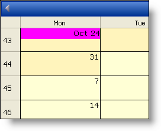

////

|metadata|
{
    "name": "webschedule-change-the-style-of-the-active-days-header",
    "controlName": ["WebSchedule"],
    "tags": ["How Do I","Scheduling","Styling"],
    "guid": "{B87DF25D-A70F-4388-A3A9-AB8F036708B6}",  
    "buildFlags": [],
    "createdOn": "0001-01-01T00:00:00Z"
}
|metadata|
////

= Change the Style of the Active Day's Header

You may need to change the header of the pick:[asp-net="link:{ApiPlatform}webui.shared{ApiVersion}~infragistics.webui.shared.smartdate~utcnow.html[ActiveDayUtc]"]  to make it stand out more. The  pick:[asp-net="link:{ApiPlatform}webui.webschedule{ApiVersion}~infragistics.webui.webschedule.dayorientedscheduleview~activedayheaderstyle.html[ActiveDayHeaderStyle]"]  controls the style of the header area of the ActiveDay in the WebMonthView™.

The ActiveDayHeaderStyle object uses the same Style class that is defined for most Infragistics ASP.NET controls.

The code below changes the three views' ActiveDayHeaderStyle BackColor to Red, and sets the  pick:[asp-net="link:{ApiPlatform}webui.shared{ApiVersion}~infragistics.webui.shared.smartdate~utcnow.html[ActiveDayUtc]"]  to October 11, 2005.

*In Visual Basic:*

----
Imports Infragistics.WebUI.Shared
...
Private Sub Page_Load(ByVal sender As System.Object, ByVal e _
  As System.EventArgs) Handles MyBase.Load
        Me.WebMonthView1.ActiveDayHeaderStyle.BackColor = Color.Magenta
        Me.WebScheduleInfo1.ActiveDay = _
          Me.WebScheduleInfo1.ConvertTimeZoneTimeToUtc(New SmartDate(2005, 10, 24))
End Sub
----

*In C#:*

----
using Infragistics.WebUI.Shared;
...
private void Page_Load(object sender, System.EventArgs e)
{
        this.WebMonthView1.ActiveDayHeaderStyle.BackColor = Color.Magenta;
        this.WebScheduleInfo1.ActiveDay = 
          this.WebScheduleInfo1.ConvertTimeZoneTimeToUtc(new SmartDate(2005, 10, 24));
}
----