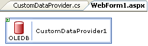

////

|metadata|
{
    "name": "webschedule-creating-a-custom-data-provider",
    "controlName": ["WebSchedule"],
    "tags": ["Data Binding","Scheduling","Tips and Tricks"],
    "guid": "{5A146AF3-C9D2-4A81-874A-34992F0DD523}",  
    "buildFlags": [],
    "createdOn": "0001-01-01T00:00:00Z"
}
|metadata|
////

= Creating a Custom Data Provider

== Before You Begin:

This walkthrough guides you through creating a simple custom data provider control for WebSchedule™ through inheritance. When you subclass an existing data provider, you gain control over much of the data provider's internal functionality. The procedure below describes data provider fundamentals to get you started.

Before you begin, picture the WebSchedule data provider as a vital organ (like the brain) supplying the WebScheduleInfo control with up-to-date activity, resource, and reminder information that it then pumps (like the heart) to the WebSchedule view controls.

The protected APIs allow you to make many powerful customizations in the data providers including:

* Modifying the default database connection string by overriding the ConnectionStringDefault property.
* Changing the factory methods that produce a Connection to the database in ADO.NET by overriding the CreateConnection method.
* Controlling how Activity and Resource information is channeled to and from your data source by implementing the IDataFetch and IDataUpdate interfaces.

When introducing your own changes into the WebSchedule "central nervous system", your history working with the built-in data providers (and a thorough understanding of the WebSchedule architecture) will help you leverage data provider base class features successfully. While creating your own data provider is powerful, you must also ensure that you do not change behavior that WebSchedule requires to function properly.

== Follow these Steps:

[start=1]
. Open a new Web Application project in Microsoft® Visual Studio® .NET.
[start=2]
. Right-click your solution, and choose "Add New Project …".
[start=3]
. From the list of templates, select "Web Control Library" and name your Web control library "CustomProvider". This allows the template project to produce an assembly file named "CustomProvider.dll" as output that you will add to your Web Application project later in step 12.

.Note:
[NOTE]
====
Web Control Library may be unavailable in some editions of Visual Studio .NET 2005, but you can alternatively choose "Class Library" and add namespaces and an assembly reference for System.Web.
====

[start=4]
. Add assembly references to the following Infragistics assemblies that the base data provider class depends upon.

** Infragistics4.WebUI.Shared.v{ProductVersion}.dll
** Infragistics4.WebUI.WebSchedule.v{ProductVersion}.dll
** Infragistics4.WebUI.WebScheduleDataProvider.v{ProductVersion}.dll

When creating a custom data provider control as a separate library from your Web application, you must ensure these assemblies have their Copy Local flags set to True.
[start=5]
. In Visual Basic .NET you must edit the properties of your "CustomProvider" Web control library to specify a default Root Namespace of "Example". (In C#, this will be handled through the code specified in step 9.)
[start=6]
. Open the source file, "WebCustomControl1.vb" (or "WebCustomControl1.cs").
[start=7]
. Add the "Infragistics.WebUI.Data" namespace to the top of the source file if it is not already present.
[start=8]
. If there is no namespace declaration around the control class, create one. In this example, the namespace, "Example", will be used. A namespace is necessary when registering the TagPrefix (see step 14).
[start=9]
. Rename the control class, "CustomDataProvider", and change it to inherit from WebScheduleOleDbProvider. You can erase much of the surplus code that comes in the pre-generated control class, leaving you with the following essential class definition.

*In Visual Basic:*

----
<ToolboxData("<{0}:CustomDataProvider runat='server'></{0}:CustomDataProvider>")> _
Public Class CustomDataProvider
  Inherits WebScheduleOleDbProvider
                ' Further customizations (constructors, properties, methods)
                ' you want to make go here.
End Class
----

*In C#:*

----
namespace Example
{
        [ToolboxData( "<{0}:CustomDataProvider runat='server'>")]
        public class CustomDataProvider : WebScheduleOleDbProvider
        {
                // Further customizations (constructors, properties, methods)
                // you want to make go here.
        }
}
----

In this example, you extend the built-in WebScheduleOleDbProvider control because it provides all the functionality your data provider needs. When subclassing a data provider, take advantage of the most fitting built-in data provider class and focus on which features you want to add or change.

.Note:
[NOTE]
====
Custom data providers that connect to a relational database management system can inherit from WebScheduleDbProvider or any of its subclasses. When using dynamic SQL and OLE DB, you should choose WebScheduleOleDbProvider. When using SQL stored procedures and a vendor-specific ADO.NET API, WebScheduleSqlClientProvider is usually the best choice.
====

[start=10]
. Right-click your Web Custom Control library project in the Solution Explorer window, and select "Build". If your project does not build properly, please review the previous steps in this procedure to ensure the necessary assemblies are referenced and that your source code has not omitted any steps and is error-free.
[start=11]
. Right-click in your Web Application project, and select "Add Reference…".
[start=12]
. Select the "Projects" tab in which you will add a reference in your Web Application to your Web Custom Control library project containing your CustomDataProvider control.
[start=13]
. Open your "WebForm1.aspx" file in Source view.

.Note:
[NOTE]
====
In Visual Studio .NET 2005, your Web site's default web form may have a file name starting with "default", and not "WebForm1".
====

[start=14]
. At the top of the ASPX page, add the following Register directive beneath the Page directive.

[source]
----
<%@ Register TagPrefix="cc" Namespace="Example" Assembly="CustomProvider" %>
----

[start=15]
. Scroll down to the <form> tag and add the following tag for your custom data provider control inside the <form> tag.

[source]
----
<cc:CustomDataProvider runat='server' id='CustomDataProvider1'></cc:CustomDataProvider>
----

[start=16]
. Open your "WebForm1.aspx.vb" (or "WebForm1.aspx.cs") code-behind file by right-clicking your web form ASPX file in the Solution Explorer window and selecting "View Code". Ensure the following line exists. This code declares a CustomDataProvider control, which matches the id attribute value you used in step 15.

*In Visual Basic:*

----
Protected WithEvents CustomDataProvider1 As Example.CustomDataProvider
----

*In C#:*

----
protected Example.CustomDataProvider CustomDataProvider1;
----

[start=17]
. If you switch your view of your Web form to Design view, you should see your Custom Data Provider control. Select it, and confirm that all of WebSchedule OLE database provider's properties are available to you in the Properties window.
[start=18]
. Drag and drop a WebScheduleInfo component and any WebSchedule view control onto the design surface from your Toolbox.
[start=19]
. Set the WebScheduleInfoID property on the WebSchedule view to "WebScheduleInfo1" to connect it to the WebScheduleInfo component.
[start=20]
. Set the WebScheduleInfoID property on your Custom Data Provider control to connect it to the WebScheduleInfo component.

.Note:
[NOTE]
====
This walkthrough uses the default WebSchedule database connection, which refers to a Microsoft Jet database file installed with Infragistics ASP.NET. For information, see link:webschedule-connecting-webschedule-to-a-database-in-visual-studio-2005.html[Connecting WebSchedule to a Database in Visual Studio 2005].
====

[start=21]
. Build and run your Web application using your custom WebSchedule data provider.

== What You Accomplished:

In this walkthrough you have successfully created a custom WebSchedule data provider through inheritance. You then used that data provider to connect to WebSchedule information. This basic custom data provider control gives you a foundation to make much more advanced changes to WebSchedule's data binding.