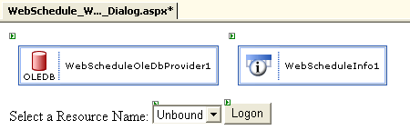

////

|metadata|
{
    "name": "webschedule-creating-a-logon-dialog-box-for-your-webschedule-application",
    "controlName": ["WebSchedule"],
    "tags": ["Scheduling","Tips and Tricks"],
    "guid": "{D12B3D95-4664-47DE-9010-B4989B45434D}",  
    "buildFlags": [],
    "createdOn": "0001-01-01T00:00:00Z"
}
|metadata|
////

= Creating a Logon Dialog Box for Your WebSchedule Application

== Before You Begin:

A common way to use WebSchedule™ in a web application is to allow users to log on and view or edit their own activities. This walkthrough creates a simple example of a logon dialog for your WebSchedule application.

Before beginning this walkthrough, you should be familiar with the concept of Resources in WebSchedule, and you should have already added a few  pick:[asp-net="link:infragistics4.webui.webschedule.v{ProductVersion}~infragistics.webui.webschedule.resource.html[Resources]"]  beyond the default "Unassigned" resource. You should have a WebScheduleInfo™ on a web form with a valid connection to your WebSchedule database.

== Follow These Steps:

[start=1]
. Before you start writing any code, you should place using/imports directives in your code-behind so you don't need to always type out a member's fully qualified name.

*In Visual Basic:*

----
Imports Infragistics.WebUI.WebSchedule
----

*In C#:*

----
using Infragistics.WebUI.WebSchedule;
----

[start=3]
. *Add a DropDownList and a Button to the logon page.*

Depending on the web application, a TextBox for entering a username might be more appropriate; plus another TextBox for password input, if necessary. But for maximum simplicity, this example uses a DropDownList and allows any user to logon as any Resource.

[start=4]
. *Add code to populate the DropDownList with Resource Names.*

This code can be added to the Page.Load event handler:

*In Visual Basic:*

----
Private Sub Page_Load(ByVal sender As Object, ByVal e As EventArgs) Handles MyBase.Load
        If Not Me.IsPostBack Then
                Dim resources As ICollection = Me.WebScheduleOleDbProvider1.FetchResources()
                If Not resources Is Nothing Then
                        Dim currentResource As Resource
                        For Each currentResource In resources
                                Me.resourceList.Items.Add(currentResource.Name)
                        Next
                End If
        End If
End Sub
----

*In C#:*

----
private void Page_Load(object sender, System.EventArgs e)
{
        if (!this.IsPostBack)
        {
                ICollection resources = this.WebScheduleOleDbProvider1.FetchResources();
                if (resources != null)
                {
                        foreach (Resource currentResource in resources)
                        {
                                this.resourceList.Items.Add(currentResource.Name);
                        }
                }
        }
}
----

[start=5]
. *Add code to handle the logon button's Click event.*

When the user clicks the logon button, the selected value in the DropDownList should be passed to the next page. The simplest and most reliable way to do this is to use a querystring:

*In Visual Basic:*

----
Private Sub logonButton_Click(ByVal sender As Object, _
  ByVal e As System.EventArgs) Handles logonButton.Click
        Me.Response.Redirect("Destination.aspx?resourceName=" + Me.resourceList.SelectedItem.Text)
End Sub
----

*In C#:*

----
private void logonButton_Click(object sender, System.EventArgs e)
{
        this.Response.Redirect("Destination.aspx?resourceName=" + this.resourceList.SelectedItem.Text);
}
----

[start=6]
. *Add code to set the WebScheduleInfo's ActiveResourceName property.*

The user is redirected to the next page (Destination.aspx), which contains one or more WebSchedule View controls. This page should evaluate the querystring passed in the previous step and set the  pick:[asp-net="link:infragistics4.webui.webschedule.v{ProductVersion}~infragistics.webui.webschedule.webscheduleinfo~activeresourcename.html[ActiveResourceName]"]  property of the WebScheduleInfo object.

*In Visual Basic:*

----
Private Sub Page_Load(ByVal sender As System.Object, ByVal e As System.EventArgs) Handles MyBase.Load
        If Not Me.IsPostBack Then
                Dim currentResourceName As String = Me.Request.QueryString("resourceName")
                If Not currentResourceName Is Nothing Then
                        Me.WebScheduleInfo1.ActiveResourceName = currentResourceName
                End If
        End If
End Sub
----

*In C#:*

----
private void Page_Load(object sender, System.EventArgs e)
{
        if (!this.IsPostBack)
        {
                string currentResourceName = this.Request.QueryString["resourceName"];
                if (currentResourceName != null)
                {
                        this.WebScheduleInfo1.ActiveResourceName = currentResourceName;
                }
        }
}
----

== What You Accomplished:

You created a logon page which allows the end user to select a Resource before being redirected to the destination page with WebSchedule View controls on it. You used a query string to pass the selected resource name, and used that to set the ActiveResourceName property on the destination page.