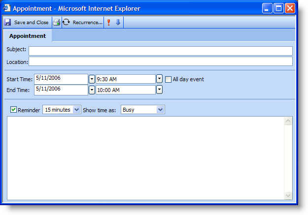
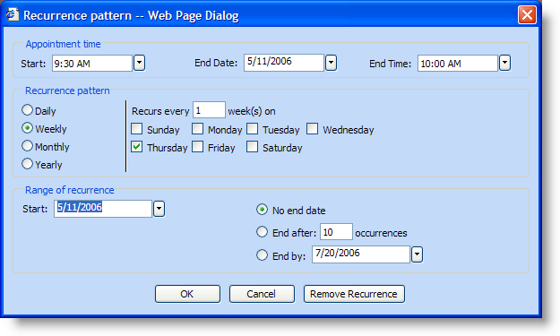
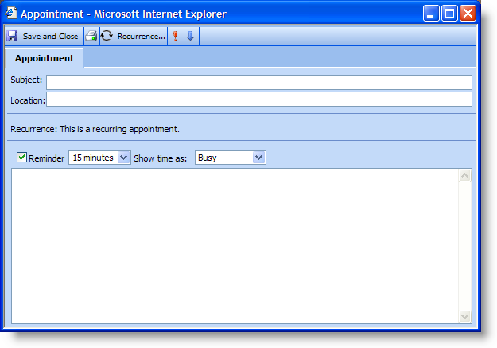
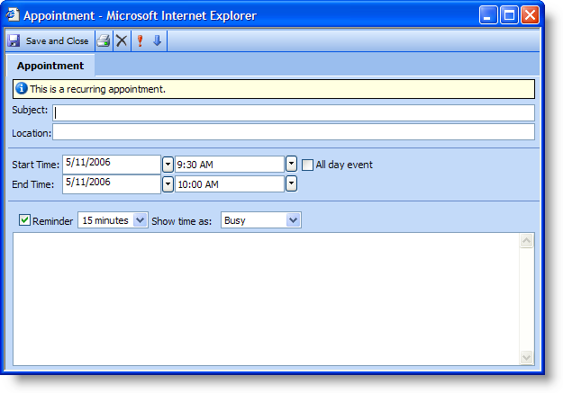
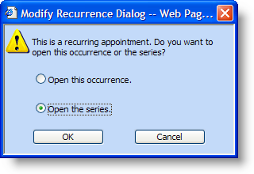
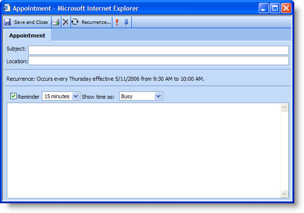

////

|metadata|
{
    "name": "webschedule-creating-and-modifying-a-recurring-appointment",
    "controlName": ["WebSchedule"],
    "tags": ["How Do I","Scheduling"],
    "guid": "{8BA32EFB-B919-4B38-B73A-6C26F1A25131}",  
    "buildFlags": [],
    "createdOn": "2006-10-04T00:00:00Z"
}
|metadata|
////

= Creating and Modifying a Recurring Appointment

== Before You Begin

A recurring appointment is a special type of  pick:[asp-net="link:{ApiPlatform}webui.webschedule{ApiVersion}~infragistics.webui.webschedule.appointment.html[Appointment]"]  that is created from a base activity. You can create the  pick:[asp-net="link:{ApiPlatform}webui.webschedule{ApiVersion}~infragistics.webui.webschedule.recurrence.html[Recurrence]"]  object either in code with the CreateRecurrence method or by using the Recurrence dialog box. Once a recurrence is created, you have the option of modifying either a single occurrence of the recurrence object or the entire series.

== What You will Accomplish

This walkthrough will guide you through the steps that the end user will take in order to create and modify a recurring appointment. For more information on the options available in the Recurrence dialog box, see the topic Using the Recurrence Pattern Dialog Box.

== Creating a Recurring Appointment

[start=1]
. The end user opens the Appointment dialog box either through a button click via code or by double-clicking a view control. The Appointment dialog box displays.

[start=2]
. The end user clicks Recurrence... on the Appointment dialog box's toolbar. The Recurrence Pattern dialog box displays with default options.

.Note:
[NOTE]
====
The recurrence button will be available only if WebScheduleInfo's™  pick:[asp-net="link:{ApiPlatform}webui.webschedule{ApiVersion}~infragistics.webui.webschedule.webscheduleinfo~enablerecurringactivities.html[EnableRecurringActivities]"]  property is set to True (by default, it is set to False).
====

[start=3]
. If the end user clicks Cancel or Remove Recurrence at this point, the dialog box closes without adding a recurrence to the appointment.
[start=4]
. If the end user clicks OK, WebScheduleInfo will validate the dialog box's settings. If the settings are valid, the Recurrence dialog box will close and update the information in the Appointment dialog box.

.Note:
[NOTE]
====
The Appointment dialog box will no longer have a start time and end time section. Instead it will display text identifying it as a recurring appointment.
====

[start=5]
. The end user clicks Save and Close on the toolbar and the information is sent to the WebScheduleInfo client-side object.

== Updating a Single Occurrence of a Recurring Apointment

[start=1]
. The end user opens the Appointment dialog box either through a button click via code or by double-clicking a view control. The Modify Recurrence dialog box displays.

[start=2]
. The end user selects "Open this occurrence" and clicks OK. The Appointment dialog box opens.

.Note:
[NOTE]
====
The Recurrence... toolbar button no longer displays and there is a status bar above the Subject that reads: "This is a recurring appointment."
====

[start=3]
. When finished modifying the appointment, the end user clicks Save and Close.

.. WebScheduleInfo checks to see if any modifications have been made to the appointment. If the appointment has not been modified, the Appointment dialog box is closed with no changes. If modifications have been made, WebScheduleInfo sends the information to the server where a new Variant is created for this recurrence.
.. WebScheduleInfo will not validate this information and will automatically update the appointment with the new values from the dialog box. The appointment will then be sent to the server where the data provider will do the validation. During validation, the data provider will check if any information differs from the original occurrence object.

== Updating a Series of Recurring Appointments

[start=1]
. The end user opens the Appointment dialog box either through a button click via code or by double-clicking a view control. The Modify Recurrence dialog box displays.

[start=2]
. The end user selects "Open the series" and clicks OK. The Appointment dialog box opens.

.Note:
[NOTE]
====
The Recurrence… toolbar button is displayed (as opposed to when the end user selects "Open this occurrence"). The StartTime and EndTime fields are also replaced with text identifying the state of the recurrence.
====

[start=3]
. After modifying the dialog box, the end user clicks Save and Close. The dialog box will notify WebScheduleInfo of the changes, which will then be sent to the server.
[start=4]
. The WebScheduleInfo component on the server will then notify the data provider that a change has occurred in the recurrence object.