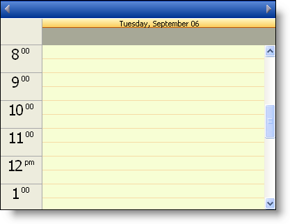
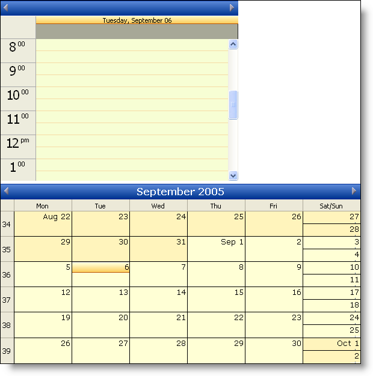
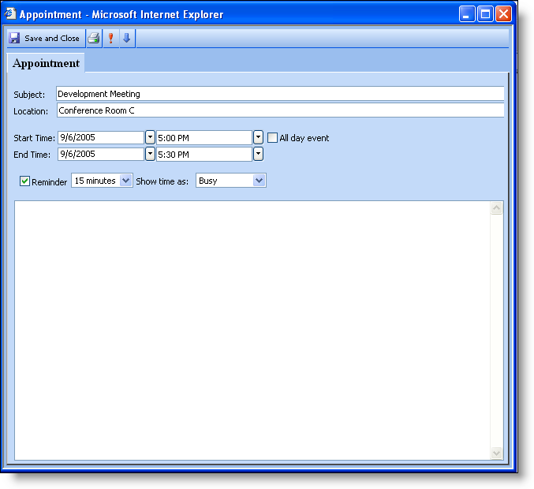
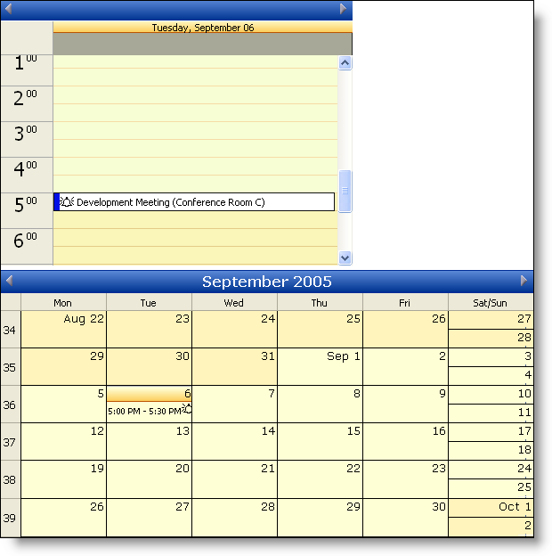

////

|metadata|
{
    "name": "webschedule-creating-webschedule-controls-using-code",
    "controlName": ["WebSchedule"],
    "tags": ["How Do I","Patterns and Practices","Scheduling"],
    "guid": "{9067D5E8-698C-40FF-A9F4-838C57FA7597}",  
    "buildFlags": [],
    "createdOn": "2005-06-09T00:00:00Z"
}
|metadata|
////

= Creating WebSchedule Controls Using Code

== Before You Begin:

With the WebSchedule™ controls it is possible to setup everything, and create instances of all the controls completely from code. This capability could be used on web forms where you want to display one of the different views, but not always have that instance sitting around in memory unless the user requests that particular view.

The following steps show you the basic controls and setup that is required to get a working WebForm with two of the WebSchedule views on it.

== Follow These Steps:

[start=1]
. Start a new WebForms Project.
[start=2]
. In the Solution Explorer, right-click the Web site, and select Add Reference…. (For more information on how to manually add references, see link:web-adding-an-assembly-to-a-project.html[Adding an Assembly to a Project]. ) The Add Reference dialog box opens.
[start=3]
. In the .NET tab, select the following references.

Infragistics.WebUI.Shared.v{ProductVersion}

Infragistics.WebUI.WebSchedule.v{ProductVersion}

[start=4]
. Click OK.
[start=5]
. Before you start writing any code, you should place using/imports directives in your code-behind so you don't need to always type out a member's fully qualified name.

*In Visual Basic:*

----
Imports Infragistics.WebUI.WebSchedule
Imports Infragistics.WebUI.Data
----

*In C#:*

----
using Infragistics.WebUI.WebSchedule;
using Infragistics.WebUI.Data;
----

[start=6]
. First you will need to create an instance of WebScheduleInfo™ and add it to the WebForm's controls collection. This must be done first because all of the other WebSchedule controls require a reference to this control, because it is basically the controller for all the WebSchedule controls. Place the following code in the Page_Load event.

*In Visual Basic:*

----
' Create a new WebScheduleInfo and set its ID
Dim myWebScheduleInfo As New WebScheduleInfo
myWebScheduleInfo.ID = "WebScheduleInfo1"
' Add the control to the WebForm's Controls collection
Me.FindControl("form1").Controls.Add(myWebScheduleInfo)
----

*In C#:*

----
// Create a new WebScheduleInfo and set its ID
WebScheduleInfo myWebScheduleInfo = new WebScheduleInfo();
myWebScheduleInfo.ID = "WebScheduleInfo1";
// Add the control to the WebForm's Controls collection
this.FindControl("form1").Controls.Add(myWebScheduleInfo);
----

[start=7]
. Second you need to create an instance of either of the WebSchedule DataProviders. You have the choice of using the WebScheduleOleDbProvider™ or the WebScheduleSqlClientProvider™. In this Walk Through we will be using the WebScheduleOleDbProvider. The following code, placed in the Page_Load event, creates an instance of the WebScheduleOleDbProvider and sets its ID property, adds it to the WebForm's controls collection, and finally sets its WebScheduleInfo property to the previously created WebScheduleInfo instance.

*In Visual Basic:*

----
' Create a new WebSchedule DataProvider and set its ID
Dim myWebScheduleDataProvider As New WebScheduleOleDbProvider
myWebScheduleDataProvider.ID = "WebScheduleDataProvider1"
' Add the control to the WebForm's Controls collection
Me.FindControl("form1").Controls.Add(myWebScheduleDataProvider)
' Assign the WebScheduleDataProvider's WebScheduleInfo to the one created in code
myWebScheduleDataProvider.WebScheduleInfo = myWebScheduleInfo
----

*In C#:*

----
// Create a new WebScheduleDataProvider and set its ID
WebScheduleOleDbProvider myWebScheduleDataProvider = new WebScheduleOleDbProvider();
myWebScheduleDataProvider.ID = "WebScheduleDataProvider1";
// Add the control to the WebForm's Controls collection
this.FindControl("form1").Controls.Add(myWebScheduleDataProvider);
// Assign the WebScheduleDataProvider's WebScheduleInfo to the one created in code
myWebScheduleDataProvider.WebScheduleInfo = myWebScheduleInfo;
----

[start=8]
. If you were to build and run the project right now you won't see anything appear on the WebForm. That is because these two controls don't have any runtime presents on the form. They provide the communication and behind the scenes setup.
[start=9]
. You are now ready to add any of the WebScheduleViews to your form. We will show you how to add the WebDayView™, and WebMonthView™ to your WebForm. The following code creates an instance of the WebDayView, assigns it a unique ID, adds it to the WebForm's controls collection, and finally sets its WebScheduleInfo property. Place the following code in the Page_Load event.

*In Visual Basic:*

----
' Create a new WebDayView and set its ID
Dim myWebDayView As New WebDayView
myWebDayView.ID = "WebDayView1"
' Add the control to the WebForm's Controls collection
Me.FindControl("form1").Controls.Add(myWebDayView)
' Assign the WebDayView's WebScheduleInfo to the one created in code
myWebDayView.WebScheduleInfo = myWebScheduleInfo
----

*In C#:*

----
// Create a new WebDayView and set its ID
WebDayView myWebDayView = new WebDayView();
myWebDayView.ID = "WebDayView1";
// Add the control to the WebForm's Controls collection
this.FindControl("form1").Controls.Add(myWebDayView);
// Assign the WebDayView's WebScheduleInfo to the one created in code
myWebDayView.WebScheduleInfo = myWebScheduleInfo;
----

[start=10]
. If you build and run the project at this point you would see the WebDayView appear on the form.

[start=11]
. Stop the project.
[start=12]
. Just for another example we will show you how to add the WebMonthView to the same WebForm and use the same WebScheduleInfo. Having the two views use the same WebScheduleInfo allows them to show the same activities. The following code creates an instance of the WebMonthView control, set its ID property, adds it to the WebForm's controls collection, and sets its WebScheduleInfo to the WebScheduleInfo instance created earlier. You will then specify the Width and Height for the control. Place the following code in the Page_Load event.

*In Visual Basic:*

----
' Create a new WebMonthView and set its ID
Dim myWebMonthView As New WebMonthView
myWebMonthView.ID = "WebMonthView1"
' Add the control to the WebForm's Controls collection
Me.FindControl("form1").Controls.Add(myWebMonthView)
' Assign the WebMonthView's WebScheduleInfo to the one created in code
myWebMonthView.WebScheduleInfo = myWebScheduleInfo
' Set the Width and Height properties on the control
myWebMonthView.Width = Unit.Pixel(600)
myWebMonthView.Height = Unit.Pixel(300)
----

*In C#:*

----
// Create a new WebMonthView and set its ID
WebMonthView myWebMonthView = new WebMonthView();
myWebMonthView.ID = "WebMonthView1";
// Add the control to the WebForm's Controls collection
this.FindControl("form1").Controls.Add(myWebMonthView);
// Assign the WebMonthView's WebScheduleInfo to the one created in code
myWebMonthView.WebScheduleInfo = myWebScheduleInfo;
// Set the Width and Height properties on the control
myWebMonthView.Width = Unit.Pixel(600);
myWebMonthView.Height = Unit.Pixel(300);
----

[start=13]
. If you build and run the project now you will get both views showing on your WebForm.

[start=14]
. If you double click on a TimeSlot on the WebDayView the Appointments Dialog will appear, and you can add a new appointment to the WebDayView and WebMonthView.

[start=15]
. Stop the project.
[start=16]
. At this point you can add any of the other WebScheduleViews to your WebForm if you wanted to.

== What You Accomplished:

After going through this Walk Through you should be able to setup any of the WebSchedule controls in code, by using the WebScheduleInfo, one of the WebScheduleDataProviders, and any of the WebScheduleViews.