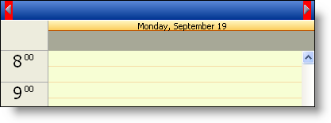

////

|metadata|
{
    "name": "webschedule-customizing-webschedules-navigational-buttons",
    "controlName": ["WebSchedule"],
    "tags": ["Navigation","Scheduling","Styling"],
    "guid": "{FED24D9B-EDF2-4313-8B44-45E97626D0E5}",  
    "buildFlags": [],
    "createdOn": "0001-01-01T00:00:00Z"
}
|metadata|
////

= Customizing WebSchedule's Navigational Buttons

== Before You Begin:

The WebSchedule's™ WebDayView™, WebMonthView™ and WebCalendarView™ have a navigational area in their header area that you can customize and style. You can replace the default buttons that are shown. For information on how to do this, see link:webschedule-customize-images-in-navigational-buttons.html[How to Customize the Navigational Buttons Images]. The  pick:[asp-net="link:{ApiPlatform}webui.webschedule{ApiVersion}~infragistics.webui.webschedule.webscheduleviewbase~navigationbuttonstyle.html[NavigationButtonStyle]"]  object is based on the standard Style object found on most of the Infragistics ASP.NET controls.

The following procedure shows you how to change the BackColor on the buttons, as well as the Cursor.

.Note:
[NOTE]
====
In this walk-through, you will be modifying the installed Cascading Style Sheet (CSS) and will remove the back color from the WebDayView's NavigationButtons in all of your projects. You may want to make this style sheet locate to just one project, if this will cause problems with other projects.
====

== Follow these Steps:

[start=1]
. Create a new ASP.NET project. Set up the WebSchedule controls on the form. For more information, see link:webschedule-using-the-webschedule-controls-quick-design.html[Quick Start using the Web Forms Designer], or link:webschedule-creating-webschedule-controls-using-code.html[Setting Up WebSchedule in Code].
[start=2]
. With the WebSchedule controls on your form and connected to a Data Provider and WebScheduleInfo, you are now ready to customize the different parts (e.g., NavigationButtonStyle).
[start=3]
. Before you can actually customize the control, you will need to modify the CSS for the WebSchedule control you are using due to the Presets the controls take on by default. The style sheets are installed in the installation path as `ig_common`, which is located in a standard installation at the following location:

`C:\Inetpub\wwwroot\aspnet_client\infragistics\{ProductVersion}\Styles`.
[start=4]
. If you have not chosen any presets, the style sheet you will want is in the Default folder. If you have chosen a different preset other than the default, navigate to that presets folder.
[start=5]
. Under the assumption that you have not modified the preset, choose the Default folder. The other assumption is that you are working with the WebDayView, so open the file called `ig_webdayview.css`. You can open this style sheet inside the Visual Studio .NET IDE to modify it. Notice that if you are working with any of the other views, they have a CSS that you can open in this same location.
[start=6]
. With the CSS open, scroll down to where it lists `igdv_NavigationButton`. The last two lines where it sets the background-image and background-position are the two properties you will be modifying. Just comment out those to lines by place /$$*$$ $$* $$/ around the those two lines. Your style sheet will look similar to the following around that style.

*In CSS:*

----
.igdv_NavButton
{
        margin-top: -1px;
        margin-bottom: 0px;
        margin-left:5px;
        margin-right:5px;
        padding: 0px;
        height: 25px;
        border: 0px;
        /*background-image: url(images/MonthHeaderCaption_bg.png);
        background-position: top left;*/
}
----

[start=7]
. Note that this modification will affect all the WebDayView's that are using this particular preset because you are modifying the style sheet from which they all pull. This is necessary because the control reads the style sheet after it reads the properties set in code. Therefore, the style sheet properties will always be taken if they are being modified in both locations.
[start=8]
. With that simple modification done, you can now go into the code behind and set the NavigationButtonStyle object. The following code snippet modifies that BackColor of the Navigation Buttons and the Cursor that is displayed when you mouse over the buttons.

*In Visual Basic:*

----
Me.WebDayView1.NavigationButtonStyle.BackColor = Color.Red
Me.WebDayView1.NavigationButtonStyle.Cursor = Infragistics.WebUI.[Shared].Cursors.Hand
----

*In C#:*

----
this.WebDayView1.NavigationButtonStyle.BackColor = Color.Red;
this.WebDayView1.NavigationButtonStyle.Cursor = Infragistics.WebUI.Shared.Cursors.Hand;
----

[start=9]
. Styling these buttons as you can see is quite simple. You may also want to style the CaptionHeaderStyle object when modifying the NavigationButtonStyle. For information on how to modify the CaptionHeaderStyle, see link:webschedule-customizing-webschedules-caption-header-area.html[Customizing the CaptionHeaderStyle].

== What You Accomplished:

This walk-through was designed to help you style the Navigational buttons displayed in the header of the WebDayView and WebMonthView.