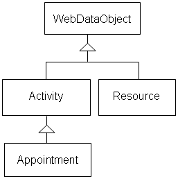

////

|metadata|
{
    "name": "webschedule-extending-appointments-and-resources",
    "controlName": ["WebSchedule"],
    "tags": ["Extending","How Do I","Scheduling"],
    "guid": "{B4FA5591-FCA8-4375-95F7-481A0569EA13}",  
    "buildFlags": [],
    "createdOn": "0001-01-01T00:00:00Z"
}
|metadata|
////

= Extending Appointments and Resources

== Before You Begin:

Business demands for real-world scheduling applications must sometimes associate additional information with the core concepts of resources (i.e., contact details such as a phone number) and activities (i.e., a follow-up date.) Inheritance is an object-oriented answer to adding properties containing extra information. In this advanced walkthrough you will learn how to extend the  pick:[asp-net="link:{ApiPlatform}webui.webschedule{ApiVersion}~infragistics.webui.webschedule.appointment.html[Appointment]"]  class with a follow-up Date property, and you will be introduced to other requirements for seamlessly integrating new properties into WebSchedule™ applications.

Before continuing you should feel comfortable using multiple WebSchedule views on a Web form that share a WebSchedule data provider, and working with existing properties on Appointment and  pick:[asp-net="link:{ApiPlatform}webui.webschedule{ApiVersion}~infragistics.webui.webschedule.resource.html[Resource]"]  objects. You should also have experience extending .NET Framework types using inheritance, overriding virtual members, and applying custom attributes.

Some background in the WebSchedule object model will help you see the big picture. Both Appointments and Resources extend a common abstract base type, the WebDataObject class. WebDataObjects can be identified by a string Key property, collected and databound with integrity checking. The Activity, Appointment, and Resource classes inherit these benefits and add their properties to this base class, just as you will.

== Follow these Steps:

[start=1]
. Before you start writing any code, you should place using/imports directives in your code-behind so you don't need to always type out a member's fully qualified name.

*In Visual Basic:*

----
Imports Infragistics.WebUI.Shared
Imports Infragistics.WebUI.WebSchedule
----

*In C#:*

----
using Infragistics.WebUI.Shared;
using Infragistics.WebUI.WebSchedule;
----

[start=2]
. Create a new class named FollowUpAppointment, extending the Appointment class.

*In Visual Basic:*

----
Public Class FollowUpAppointment
  Inherits Appointment
	' Class definition will go here.
End Class
----

*In C#:*

----
public class FollowUpAppointment : Appointment
{
	// Class definition will go here.
}
----

[start=3]
. All appointments belong to a WebScheduleInfo™ component which manages their collection, their organizing Resource, and communication to and from the client-side, and coordinates data binding with a WebSchedule data provider. Your Appointment subclass must have a public constructor accepting at least one parameter, a WebScheduleInfo component to pass your base Appointment constructor.

*In Visual Basic:*

----
' Class definition will go here.
Public Sub New( ByVal info As WebScheduleInfo )
	MyBase.New( info)
End Sub
----

*In C#:*

----
// Class definition will go here.
public FollowUpAppointment( WebScheduleInfo info) : base( info)
{
	;
}
----

Your constructor may have more than one parameter, especially if the parameters initialize new properties that your subclass adds.
[start=4]
. Add a FollowUpDate property to your FollowUpAppointment class. You don't need to add a field to store this property value, since you will make WebDataObject manage your Appointment's custom property values.

*In Visual Basic:*

----
Public Property FollowUpDate() As DateTime
	Get
		' Read follow up date value.
	End Get
	Set
		' Write follow up date value.
	End Set
End Property
----

*In C#:*

----
public DateTime FollowUpDate
{
	get
	{
		// Read follow up date value.
	}
	set
	{
		// Write follow up date value.
	}
}
----

.Note:
[NOTE]
====
In a global Web scheduling application, any date/time properties must be stored in a time zone-independent format. Therefore, you should convert them to/from Universal Coordinated Time (UTC) when storing/retrieving their value. Although not shown here, WebScheduleInfo provides your Appointment subclass with two methods for converting date/time values (wrapped in a SmartDate object) between UTC and the application's "display" time zone. See the  pick:[asp-net="link:{ApiPlatform}webui.webschedule{ApiVersion}~infragistics.webui.webschedule.webscheduleinfo~convertutctotimezonetime.html[ConvertUtcToTimeZoneTime]"]  and  pick:[asp-net="link:{ApiPlatform}webui.webschedule{ApiVersion}~infragistics.webui.webschedule.webscheduleinfo~converttimezonetimetoutc.html[ConvertTimeZoneTimeToUtc]"]  methods for more information.
====

[start=5]
. Add a static FollowUpDateId field to your FollowUpAppointment class.

*In Visual Basic:*

----
Private Shared FollowUpDateId As String = "FollowUpDate"
----

*In C#:*

----
private static string FollowUpDateId = "FollowUpDate";
----

WebDataObject associates the property values that it manages with property names (sometimes referred to as property IDs). For each custom property you add to your Appointment subclass, you should add a string identifier naming the property for storage and retrieval purposes.
[start=6]
. Add a property getter implementation to the FollowUpDate property you added in step 3. You will use the GetValue method to retrieve a value associated with the name, "FollowUpDate", for this WebDataObject. If no value was previously stored with that name, your second argument to the GetValue method is the default value that should be used.

*In Visual Basic:*

----
' Read follow up date value.
MyBase.GetValue( _
  FollowUpAppointment.FollowUpDateId, _
  DateTime.MaxValue )
----

*In C#:*

----
// Read follow up date value.
base.GetValue(
  FollowUpAppointment.FollowUpDateId,
  DateTime.MaxValue );
----

[start=7]
. Add a property setter implementation to the FollowUpDate property you added in step 3. You will use the SetValue method to initialize a stored value accessible using the FollowUpDateId property.

*In Visual Basic:*

----
' Write follow up date value.
MyBase.SetValue( _
	FollowUpAppointment.FollowUpDateId, _
	Value, _
	DateTime.MaxValue )
----

*In C#:*

----
// Write follow up date value.
base.SetValue(
  FollowUpAppointment.FollowUpDateId,
  value, 
  DateTime.MaxValue );
----

.Note:
[NOTE]
====
Sometimes when using the SetValue method, the compiler may require you to typecast your 'value' argument to call the correct overload method.
====

[start=8]
. Add this class definition to a Web Application project that already contains a WebScheduleInfo control and WebSchedule view control, and add the following code to your Web form's Page_Load event handler.

*In Visual Basic:*

----
Protected Sub Page_Load(ByVal sender As System.Object, _
  ByVal e As System.EventArgs) Handles MyBase.Load
	' Create your custom appointment.
	Dim customAppt As FollowUpAppointment
	customAppt = New FollowUpAppointment(Me.WebScheduleInfo1)
	' Initialize key properties.
	customAppt.Key = "6088100510"
	customAppt.ResourceKey = _
	  Me.WebScheduleInfo1.VisibleResources.UnassignedResource.Key
	customAppt.StartDateTimeUtc = SmartDate.Now
	customAppt.FollowUpDate = DateTime.Now.AddDays(1.0)
	' Add it to the Activities collection.
	Me.WebScheduleInfo1.Activities.Add(customAppt)
End Sub
----

*In C#:*

----
protected void Page_Load( object sender, System.EventArgs e)
{
	// Create your custom appointment.
	FollowUpAppointment customAppt;
	customAppt = new FollowUpAppointment( this.WebScheduleInfo1);
	// Initialize key properties.
	customAppt.Key = "6088100510";
	customAppt.ResourceKey = 
	  this.WebScheduleInfo1.VisibleResources.UnassignedResource.Key;
	customAppt.StartDateTimeUtc = SmartDate.Now;
	customAppt.FollowUpDate = DateTime.Now.AddDays( 1.0);
	// Add it to the Activities collection.
	this.WebScheduleInfo1.Activities.Add( customAppt);
}
----

== What You Accomplished:

This code creates a FollowUpAppointment object, associating it with the WebScheduleInfo component on your Page using the constructor you created in step 2. It initializes your FollowUpAppointment by setting important properties that all appointments must have (a Key, the Key of an associated Resource, and a StartDateTimeUtc), and then sets a FollowUpDate 24 hours into the future with the custom property you added in steps 3 through 6. Finally, it adds this appointment to the Activities collection so it will display on all views attached to this WebScheduleInfo component.

You have successfully added a custom property to the Appointment class using inheritance, and added an instance of your custom Appointment to the Activities collection of WebScheduleInfo. You can now show your custom Appointment alongside other Appointments that may have been retrieved from other sources, including the WebSchedule data provider. As a next step, you may want to show your new custom property in your Web application, or enhance the WebSchedule data providers to store and update your custom Appointment in the database.