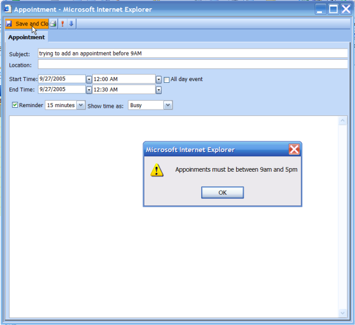

////

|metadata|
{
    "name": "webschedule-limiting-appointment-dates-and-times",
    "controlName": ["WebSchedule"],
    "tags": ["How Do I","Scheduling","Styling"],
    "guid": "{5645FB97-7B4F-49D2-911C-43C7CAD92BD4}",  
    "buildFlags": [],
    "createdOn": "0001-01-01T00:00:00Z"
}
|metadata|
////

= Limiting Appointment Dates and Times

== Before You Begin:

A common requirement in schedule applications is to restrict appointment times. For example, users should only be able to schedule appointments during business hours, and appointments cannot be scheduled on weekends.

This walkthrough will prevent users from adding appointments at restricted times and on weekends, and it will also prevent them from rescheduling appointments to fall within these restricted times.

Before beginning this walkthrough, you should be familiar with how to set up a WebScheduleInfo™ and WebSchedule View controls on a page. You should have a WebScheduleInfo on a web form with a valid connection to your WebSchedule database.

== Follow These Steps:

[start=1]
. *Add a WebDayView control to the form.*

Add a WebDayView™ control to the form and set its WebScheduleInfoID property to the ID of your WebScheduleInfo. This WebDayView is the only View needed by this walkthrough.
[start=2]
. Handle the WebScheduleInfo's ActivityDialogEdit and ActivityUpdating client-side events and write code to limit appointment times.

*In ASP.NET:*

----
<ig_sched:WebScheduleInfo id="WebScheduleInfo1" runat="server">
        <ClientEvents ActivityDialogEdit="WebScheduleInfo1_ActivityDialogEdit" ActivityUpdating="WebScheduleInfo1_ActivityUpdating"></ClientEvents>
</ig_sched:WebScheduleInfo>
----

The following code snippet demonstrates these two client-side events as well as other methods and properties of the WebScheduleInfo client-side object. For documentation on this subject, refer to the link:webschedule-csom.html[WebSchedule Client-Side Object Model].

*In JavaScript:*

----
function WebScheduleInfo1_ActivityDialogEdit(oScheduleInfo, oEvent, oActivityEditProps ){
        if(oActivityEditProps.StartDate != null) {
                if((oActivityEditProps.StartDate.Value.getDay() == 6) || (oActivityEditProps.StartDate.Value.getDay() == 0))
                {
                        oActivityEditProps.window.alert("Appoinments cannot be set on a weekend day");
                        oEvent.cancel = true;
                }
        }
        if(oActivityEditProps.StartTime != null) {
                if(oActivityEditProps.StartTime.Value.getHours() < 9 || oActivityEditProps.StartTime.Value.getHours() > 16)
                {
                        oActivityEditProps.window.alert("Appoinments must be between 9am and 5pm");
                        oEvent.cancel = true;
                }
        }
        if(oActivityEditProps.Duration != null) {
                if(oActivityEditProps.Duration.Value > 120)
                {
                        oActivityEditProps.window.alert("Appoinments longer than 2 hours not permitted");
                        oEvent.cancel = true;
                }
        }
}
function WebScheduleInfo1_ActivityUpdating(oScheduleInfo, oEvent, oActivityUpdateProps, oActivity, id){
        if(oActivityUpdateProps.StartDateTime != null) {
                if((oActivityUpdateProps.StartDateTime.getDay() == 6) || (oActivityUpdateProps.StartDateTime.getDay() == 0))
                {
                        alert("Appoinments cannot be set on a weekend day");
                        oEvent.cancel = true;
                }
                if(oActivityUpdateProps.StartDateTime.getHours() < 9 || oActivityUpdateProps.StartDateTime.getHours() > 16)
                {
                        alert("Appoinments must be between 9am and 5pm - " + oActivityUpdateProps.StartDateTime);
                        oEvent.cancel = true;
                }
        }
        if(oActivityUpdateProps.Duration != null) {
                if(oActivityUpdateProps.Duration > 120)
                {
                        alert("Appoinments longer than 2 hours not permitted");
                        oEvent.cancel = true;
                }
        }
}
-$$->$$</script>
----

[start=3]
. *Run the project.*

Compile the project and browse to the page. Double-click on a time slot before 9AM to observe the behavior of these client-side functions.

Also try creating an appointment during business hours, then try to resize the appointment so that its end time occurs after 5:00. The validation will be performed then as well.

== What You Accomplished:

You used client-side validation code to limit when appointments can be added or rescheduled. You should now be familiar with the ActivityDialogEdit and ActivityUpdating client-side events.

