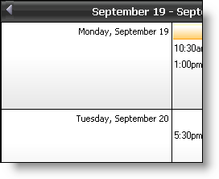

////

|metadata|
{
    "name": "webschedule-load-a-preset",
    "controlName": ["WebSchedule"],
    "tags": ["How Do I","Scheduling","Styling"],
    "guid": "{71513226-6917-4376-B20D-AB83CA869996}",  
    "buildFlags": [],
    "createdOn": "0001-01-01T00:00:00Z"
}
|metadata|
////

= Load a Preset

All of the WebSchedule™ controls can have presets applied to them at run-time, using the  pick:[asp-net="link:infragistics4.webui.shared.v{ProductVersion}~infragistics.webui.webcontrols.webcontrolbase~loadpreset.html[LoadPreset]"]  method. This method has several overloads, taking a the name of the preset file, and a boolean.

The boolean determines if the control will be reset before the new preset is applied.

.Note:
[NOTE]
====
This reset will clear the  pick:[asp-net="link:infragistics4.webui.webscheduledataprovider.v{ProductVersion}~infragistics.webui.data.webscheduledataproviderbase~webscheduleinfoid.html[WebScheduleInfoID]"]  also, and you would have to reset the WebScheduleInfo™ for the control at run-time if you apply Presets and pass in true as the boolean, at run-time.
====

The code snippet below shows how to apply a preset at run-time, and reset the the control, and then reset the control's WebScheduleInfo.

*In Visual Basic:*

----
Private Sub Page_Load(ByVal sender As System.Object, ByVal e _
  As System.EventArgs) Handles MyBase.Load
        Me.WebWeekView1.LoadPreset(Me.MapPath("Onyx.xml"), True)
        Me.WebWeekView1.WebScheduleInfo = Me.WebScheduleInfo1
End Sub
----

*In C#:*

----
private void Page_Load(object sender, System.EventArgs e)
{
        this.WebWeekView1.LoadPreset(this.MapPath("Onyx.xml"), true);
        this.WebWeekView1.WebScheduleInfo = this.WebScheduleInfo1;
}
----