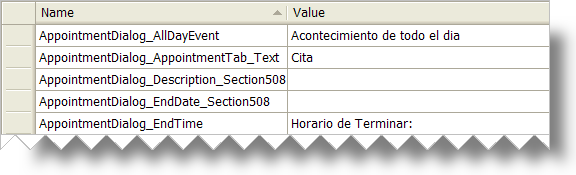

////

|metadata|
{
    "name": "webschedule-localize-the-webschedule-forms-project",
    "controlName": ["WebSchedule"],
    "tags": ["How Do I","Scheduling"],
    "guid": "{D648B193-BE95-4D66-8581-E433C20C7F65}",  
    "buildFlags": [],
    "createdOn": "0001-01-01T00:00:00Z"
}
|metadata|
////

= Localize the WebSchedule Forms Project

Localizing Web projects can be a time-consuming process when creating global applications. The WebSchedule controls and components can be easily localized by selecting the setting WebScheduleInfo's™  pick:[asp-net="link:{ApiPlatform}webui.webschedule{ApiVersion}~infragistics.webui.webschedule.webscheduleinfo~cultureinfo.html[CultureInfo]"]  property. However, setting this property has no effect on the different WebSchedule forms (i.e., Appointment, Recurrence, and Reminder).

Because the WebSchedule forms are located in a separate Web project file, we have fully localized the project by creating the string.resx file located in the App_GlobalResources folder. Before you modify any of these forms, it's important to understand the link:webschedule-guidelines-for-customizing-the-appointments-and-reminders-forms.html[Guidelines for Customizing the Appointments and Reminders Forms].

To create a new .resx file for a different culture, create a copy of the string.resx file and rename it to a different culture, such as string.es-ES.resx for the Spanish locale. Replace the Value string for each value that needs to be translated.

The following screen show displays the Appointment form translated into the Spanish locale.

.Note:
[NOTE]
====
You need to change the Web browser's language before running your application. In the Web browser, set the language to the appropriate language through the browser's Languages window. In Microsoft® Internet Explorer®, select Internet Options on the Tools menu, then click Languages…. In Mozilla® Firefox® 2.0, select Options on the Tools menu. Then click Advanced, click the General tab, and click Choose. In the Languages window, select a new language and click the Move Up button until the new language is at the top of the list.
====

== Related Topic

link:webschedule-guidelines-for-customizing-the-appointments-and-reminders-forms.html[Guidelines for Customizing the Appointments and Reminders Forms]