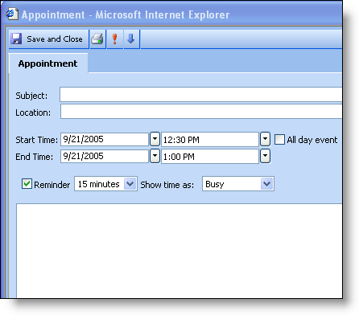

////

|metadata|
{
    "name": "webschedule-printing-an-appointment",
    "controlName": ["WebSchedule"],
    "tags": ["How Do I","Printing","Scheduling"],
    "guid": "{3BE7814C-1E98-4452-B04D-97455A2F9BC2}",  
    "buildFlags": [],
    "createdOn": "0001-01-01T00:00:00Z"
}
|metadata|
////

= Printing an Appointment

The Appointment Dialog contains a toolbar button with a print icon. When the button is pressed, the default print dialog for the browser appears which allows you select your printer to print.

If you've gone into the Forms Project, you may have noticed a file called "Print.htm". This file is used to control the format of the printed information. All information for this document is pulled from the Appointment Dialog at runtime. This includes all labels and fields.

The structure of the "Print.htm" file is completely customizable. However, no fields or labels should be removed as this will result in a JavaScript error. If you would like to stop any information from being printed, you can set the visibility style of that field or label to hidden.

.Note:
[NOTE]
====
any text set in any of the fields or labels that already exist will be overwritten during the print operation.
====

